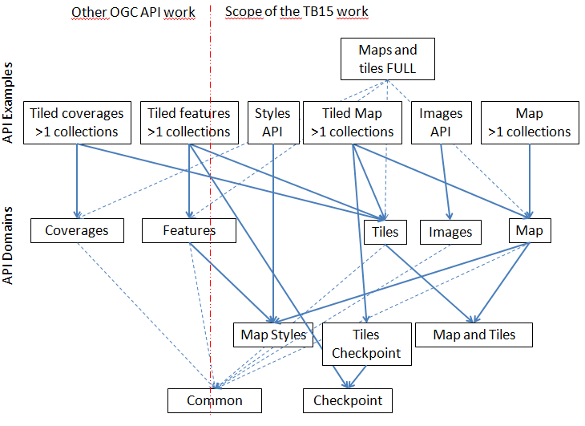

# OGC-API-Map-Tiles

This GitHub repository contains the new revision of the [OGC](http://opengeospatial.org)'s Web Map Service and Web Map Tile Service standards for requesting maps and tiles of geospatial information on the web. It is a complete rewrite of previous versions, focusing on a simple RESTful core specified as reusable [OpenAPI](http://openapis.org) components.

This work encompasses two standards that will be developed simultaneously. In the end, must people believe at least 2 standards will emerge or even more when the core and extension model is applied.

## Examples
For the moment this work is focused on providing OpenAPI services description examples and domains (libraries)

IMPORTANT NOTE: We are now using the Swagger HUB again and should be considered the "gold copy". The Swagger account is:
* [Domain documents](https://app.swaggerhub.com/search?owner=UAB-CREAF&type=DOMAIN)
* [API example documents](https://app.swaggerhub.com/search?owner=UAB-CREAF&type=API)

The material in the [standards folder](standard/openapi) takes precedence to the text.

The files in the [standards folder](standard/openapi) are structured in several parts that can be combined together.



Examples:
* A [OGC API maps and tiles OPF FULL example](standard/openapi/ogc-api-map-tiles-opf-xmp-full.yaml) that contains full example of server with some features and coverages that are served as maps and/or tiles. Normally it is too long to be analyzed. The following are more easy to understand.
* A [OGC API OPF example for vector tiles](standard/openapi/ogc-api-tiles-opf-xmp-vt-more-1-collection.yaml) that describes a service that can serve only tiled features (vector tiles) of one or more collections.
* A [OGC API OPF example for tiled map](standard/openapi/ogc-api-map-tiles-opf-xmp-mt-more-1-collection.yaml) that describes a service that can serve only map (raster) tiles of one or more collections.
* A [OGC API OPF example for maps](standard/openapi/ogc-api-maps-opf-xmp-ore-1-collection.yaml) that describes a service that can serve only maps of one or more collections.
* A [OGC API OPF example for tiled coverages](standard/openapi/ogc-api-tiles-opf-xmp-vt-more-1-collection.yaml) that describes a service that can serve tiled coverages of one or more collections. This example was not initially needed by the sponsors but is motivated by the elevation map in a GeoPackage example.

Libraries:
* A [OGC API common DOMAIN document](standard/openapi/ogc-api-common.yaml). It contains fragments that can be reference in api document instances or other domain document. It could become part of a future OGC API common standard additional material.
* A [OGC API maps DOMAIN document](standard/openapi/ogc-api-maps.yaml). It contains fragments that can be reference in api document instances or other domain document. It could become part of a future OGC API maps standard additional material.
* A [OGC API tiles DOMAIN document](standard/openapi/ogc-api-tiles.yaml). It contains fragments that can be reference in api document instances or other domain document. It could become part of a future OGC API tiles standard additional material.
* A [OGC API maps and tiles DOMAIN document](standard/openapi/ogc-api-map-tiles.yaml). It contains fragments that can be reference in api document instances or other domain document. It will be included by OGC API maps standard and tiles standard.

## Overview

IMPORTANT NOTE: The description in this README.md can be older than the one in the [standard](standard) draft. In case of discrepancy the standard draft takes precedence.

### Maps

A "OGC API - Maps" is a standard API that provides maps representing geospatial data.

```
GET /.../.../map/{styleId}
```

The identifier of the "layer" is replaced by "{collectionId}" or "coverage"...

Maps can be requested in any available CRS and can be subset by bbox width and height (and eventually other parameters such as time and elevation)
```
GET /.../.../map/{styleId}?crs=CRS84&bbox=160.6,-55.95,-170,-25.89&width=600&height=400
```
Returns a map - a representation of real-world elements at a given resolution. {styleId} is optional.


### Tiles

A "OGC API - Tiles" is a standard API that provides tiles of maps representing geospatial data.

```
GET /.../.../tile/{styleId}/{tileMatrixSetId}/{tileMatrixId}/{tileRow}/{tileCol}
```

Returns a tile - a representation of real-world elements at a given resolution restricted by the selected Tile Matrix Set. {styleId} is optional.

The identifier of the "layer" is replaced by "{collectionId}" or "coverage"...

Tiles are available at some TileMatrixSetId and styles that need to be enumerated in:
```
GET /.../.../tiles
```

There is a need for describing the TileMatrixSet available
```
GET /tileMatrixSet/{tileMatrixSetId}
```

## Using the standard

Those who want to just see the endpoints and responses can explore generic
OpenAPI definitions in this folder (please paste one of them in the Swagger Editor):

* OGC-API-Map-Tiles/standard/openapi/

## Communication

Join the WMS mailing list

Most all work on the specification takes place in [GitHub issues](https://github.com/opengeospatial/OGC-API-Map-Tiles/issues),
so browse there to get a good idea of what is happening, as well as past decisions.

## Contributing

The contributor understands that any contributions, if accepted by the OGC Membership (and eventually the ISO/TC 211), shall be incorporated into OGC and ISO/TC 211 Web Map Service and Web Map Tile Service standards documents and that all copyright and intellectual property shall be vested to the OGC.

The WMS Standards Working Group (SWG) is the group at OGC responsible for the stewardship of the standard, but is working to do as much work in public as possible.

* [Open issues](https://github.com/opengeospatial/OGC-API-Map-Tiles/issues)
* [Copy of License Language](https://raw.githubusercontent.com/opengeospatial/OGC-API-Map-Tiles/master/LICENSE)
