[appendix]
:appendix-caption: Annex
[[annex_examples]]
== Examples (informative)
This annex provides a set of examples illustrating requests and responses for retrieving maps using capabilities defined by this Maps API.

=== Default map
The first example shows the response of a map endpoint with a request with no parameters (https://maps.gnosis.earth/ogcapi/collections/OpenMapLocal/map).

The server is free to respond with any `bbox` and any `width` and `height`.
In this case the server default behavior is to render the whole of Great Britain in a 631x1024 pixels canvas.

[#img_xmp_map_no_param,reftext='{figure-caption} {counter:figure-num}']
.Great Britain data served as a map without specifying any parameter. From: https://www.ordnancesurvey.co.uk/products/os-open-map-local[OS OpenMap - Local], by the Ordnance Survey.
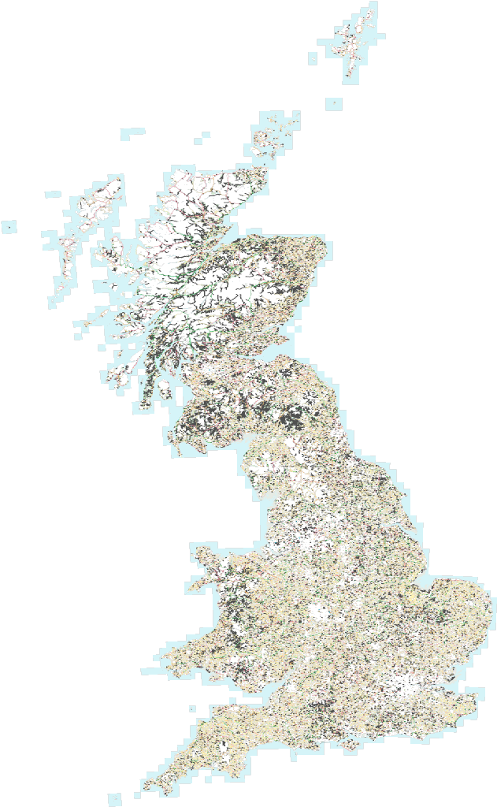

The headers of the response provide additional information on the bounding box (`Content-Bbox`) and the CRS of the image (`Content-Crs` is omitted here, indicating the default CRS84).

[%unnumbered%]
[source]
----
HTTP/1.1 200 OK
Expires: Tue, 19 Nov 2024 09:58:40 GMT
Access-Control-Allow-Origin: *
Vary: Accept, Accept-Encoding, Prefer
Content-Type: image/png
Content-Bbox: -8.756498,49.814737,1.848147,60.948016
Content-Length: 538037
----

=== Collection description
This map resource is attached to an https://docs.ogc.org/DRAFTS/20-024.html[_OGC API - Common - Part 2_] collection origin, which is available from the parent resource path:

https://maps.gnosis.earth/ogcapi/collections/OpenMapLocal?f=json[https://maps.gnosis.earth/ogcapi/collections/OpenMapLocal]

An example JSON collection description response for the OS OpenMap Local collection is below:

[%unnumbered%]
[source,JSON]
----
{
   "id" : "OpenMapLocal",
   "title" : "OS OpenMap - Local",
   "description" : "OS OpenMap - Local, by the OrdnanceSurvey",
   "attribution" : "<a href='https://www.ordnancesurvey.co.uk/products/os-open-map-local'>OS OpenMap - Local</a>",
   "extent" : {
      "spatial" : {
         "bbox" : [ [ -8.7564981947375, 49.8147371614082,
                       1.8481470870055, 60.9480162305518 ] ]
   } },
   "minScaleDenominator" : 4265.4591676995678,
   "minCellSize" : 0.0000107288361,
   "storageCrs" : "https://www.opengis.net/def/crs/OGC/1.3/CRS84",
   "crs" : [
      "https://www.opengis.net/def/crs/OGC/1.3/CRS84",
      "https://www.opengis.net/def/crs/EPSG/0/4326",
      "https://www.opengis.net/def/crs/EPSG/0/3857",
      "https://www.opengis.net/def/crs/EPSG/0/3395"
   ],
   "links" : [
      { "rel" : "self", "title" : "Information about the OpenMapLocal data",
        "href" : "/ogcapi/collections/OpenMapLocal"
      },
      { "rel" : "[ogc-rel:map]", "title" : "Default map",
        "href" : "/ogcapi/collections/OpenMapLocal/map"
      },
      { "rel" : "[ogc-rel:tilesets-map]",
        "title" : "Map tilesets available for this collection",
        "href" : "/ogcapi/collections/OpenMapLocal/map/tiles"
      },
      { "rel" : "[ogc-rel:tilesets-vector]",
        "title" : "Multi-layer vector tilesets available for this collection",
        "href" : "/ogcapi/collections/OpenMapLocal/tiles"
      },
      { "rel" : "[ogc-rel:styles]", "title" : "Styles for OpenMapLocal",
        "href" : "/ogcapi/collections/OpenMapLocal/styles"
      }
   ]
}
----

// page break to keep request & response together in PDF
<<<

=== Scaling and subsetting the map
The following examples are going to be centered on The O2 (formerly known as the Millenium Dome) shown here in a night aerial picture.
Note that the roundness of the feature facilitates validating its aspect ratio in physical units.

[#o2_dome,reftext='{figure-caption} {counter:figure-num}']
.The O2 dome peninsula (image captured from a plane by an editor of this standard while working on this annex)
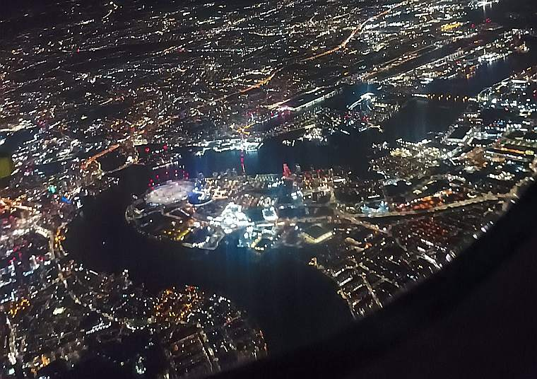

// page break to keep request & response together in PDF
<<<

The following map request only specifies a `center` point parameter next to the O2 Dome:

https://maps.gnosis.earth/ogcapi/collections/OpenMapLocal/map?center=0,51.5

The server interprets the coordinates as CRS84 and decides to respond with a low scale denominator (high level of detail) suitable for the dataset and with reasonable default `width` and `height` (1024x1024 pixels).
The response is shown in the following image.

[#xmp_map_center,reftext='{figure-caption} {counter:figure-num}']
.Map of OS OpenMap - Local close to The O2 dome, specifying `center` at 51.5°N, 0°E
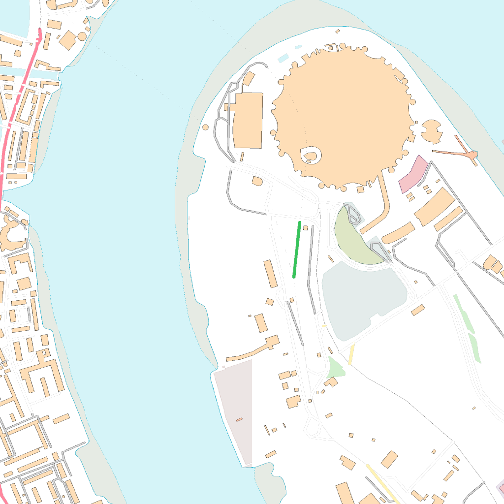

The headers of the response provide additional information on the bounding box (`Content-Bbox`).
Since the `Content-Crs` is not specified in this case, the client can assume CRS84.

[%unnumbered%]
[source]
----
HTTP/1.1 200 OK
Expires: Tue, 19 Nov 2024 09:57:36 GMT
Access-Control-Allow-Origin: *
Vary: Accept, Accept-Encoding, Prefer
Content-Type: image/png
Content-Bbox: -0.008805,51.494504,0.008805,51.505496
Content-Length: 188490
----

The following request is equivalent, using the value of that `Content-Bbox` as the value for the `bbox` parameter instead of using `center`, explicitly specifying the same `width` and `height` dimensions as those
default values chosen by the server for the above request:

https://maps.gnosis.earth/ogcapi/collections/OpenMapLocal/map?bbox=-0.008805,51.494504,0.008805,51.505496&width=1024&height=1024

There is also an equivalent notation for the previous request that uses `subset` instead of `bbox`:

https://maps.gnosis.earth/ogcapi/collections/OpenMapLocal/map?subset=Lat(51.494504:51.505496),Lon(-0.008805:0.008805)&width=1024&height=1024

As explained in the <<scaling-aspect-ratio, scale and aspect ratio considerations section>>, clients wishing to retrieve identical responses from different implementations should specify either of these `bbox` or `subset` parameters,
together with a `width` and `height`.
A smaller image can be requested by specifying `height` of the image.

https://maps.gnosis.earth/ogcapi/collections/OpenMapLocal/map?center=0,51.5&height=512

[#xmp_map_center_h_512,reftext='{figure-caption} {counter:figure-num}']
.Map of OS OpenMap - Local centered on The O2 dome using `height=512`
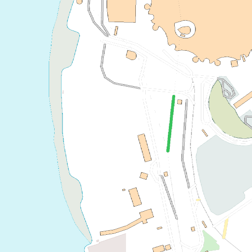

The server would be free to act otherwise, but it automatically adjusted the width to also be 512.
Notice that to preserve the same default scale with a smaller image, the spatial region (bounding box) was reduced accordingly.
This behavior is particularly important when the client requests a specific scale, as in the following request which specifies the same `center` point parameter as before,
but requests a map for a 1:8000 scale:

// page break to keep request & response together in PDF
<<<

https://maps.gnosis.earth/ogcapi/collections/OpenMapLocal/map?center=0,51.5&height=512&scale-denominator=8000

[#xmp_map_center_scale8000,reftext='{figure-caption} {counter:figure-num}']
.Map of OS OpenMap - Local centered on The O2 dome at 1:8000 scale using `scale-denominator`
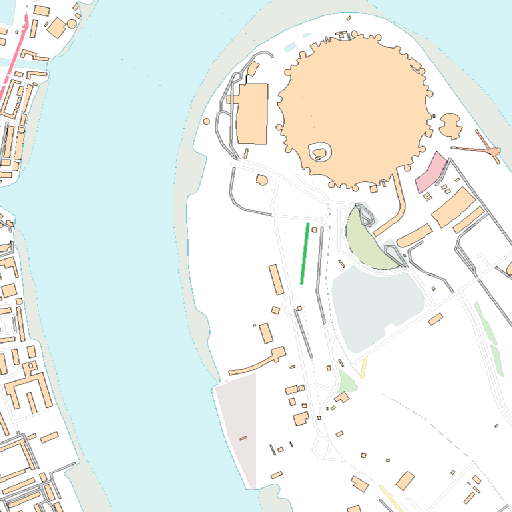

The server responded with the same `width` and `height` (512x512 pixels).
The headers of the response provide additional information on the bounding box of the image.

Clients can easily zoom in and out by simply changing the `scale-denominator` parameter as in the following images at different scales:

[#xmp_map_center_scale12000,reftext='{figure-caption} {counter:figure-num}']
.Map of OS OpenMap - Local centered on The O2 dome https://maps.gnosis.earth/ogcapi/collections/OpenMapLocal/map?center=0,51.5&height=512&scale-denominator=12000[at 1:12,000 scale] using `scale-denominator`
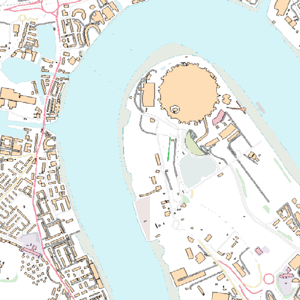

[#xmp_map_center_scale20000,reftext='{figure-caption} {counter:figure-num}']
.Map of OS OpenMap - Local centered on The O2 dome https://maps.gnosis.earth/ogcapi/collections/OpenMapLocal/map?center=0,51.5&height=512&scale-denominator=20000[at 1:20,000 scale] using `scale-denominator`
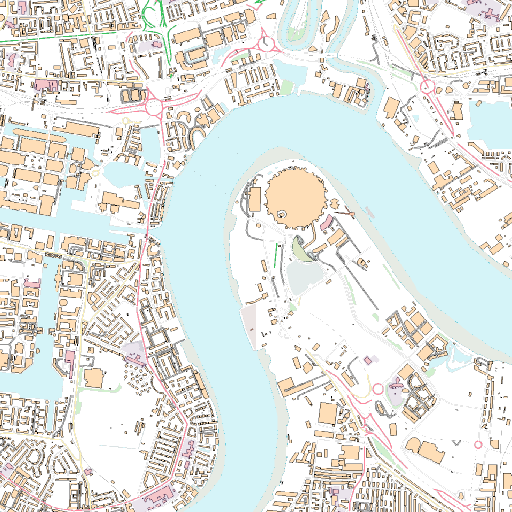

[#xmp_map_center_scale30000,reftext='{figure-caption} {counter:figure-num}']
.Map of OS OpenMap - Local centered on The O2 dome https://maps.gnosis.earth/ogcapi/collections/OpenMapLocal/map?center=0,51.5&height=512&scale-denominator=30000[at 1:30,000 scale] using `scale-denominator`
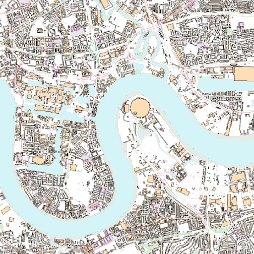

[#xmp_map_center_scale50000,reftext='{figure-caption} {counter:figure-num}']
.Map of OS OpenMap - Local centered on The O2 dome https://maps.gnosis.earth/ogcapi/collections/OpenMapLocal/map?center=0,51.5&height=512&scale-denominator=50000[at 1:50,000 scale] using `scale-denominator`
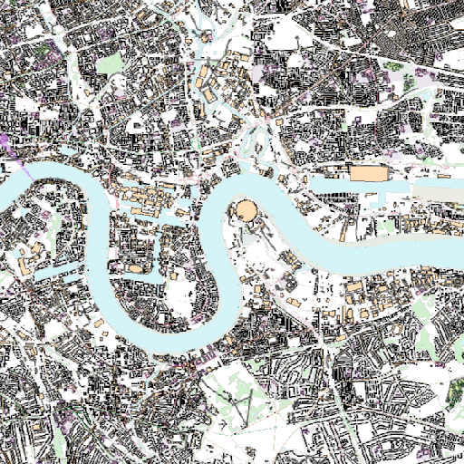

// page break to keep request & response together in PDF
<<<

A rectangular image could be “forced” by also specifying the width of the image to be 1024, while keeping the rest of the parameters:

https://maps.gnosis.earth/ogcapi/collections/OpenMapLocal/map?center=0,51.5&scale-denominator=50000&width=1024&height=512

[#xmp_map_center_scale_hw_1024x512,reftext='{figure-caption} {counter:figure-num}']
.Wider 1024x512 map of OS OpenMap - Local centered on the O2 dome at 1:50,000 scale
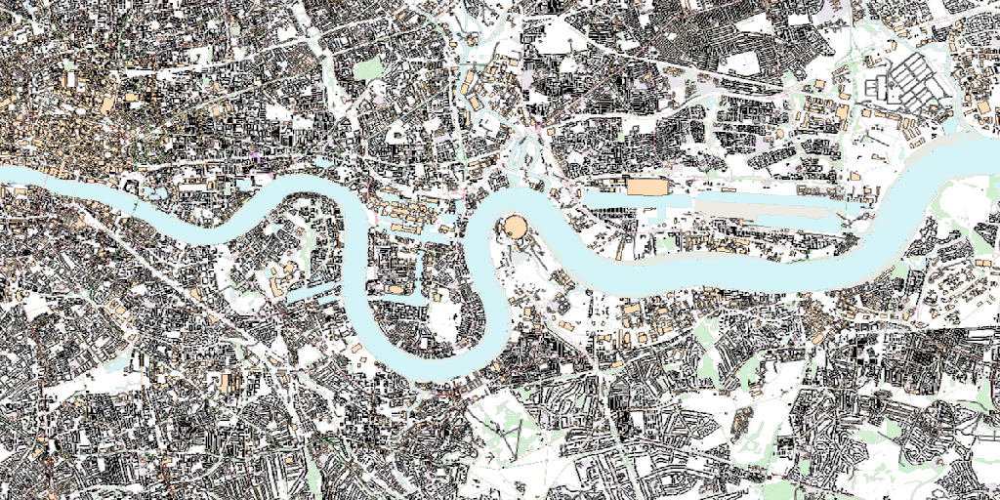

For this last request, specifying both the `width` and `height`, the `center`, the `scale-denominator`, combined with the fact that the default value of `mm-per-pixel`
is defined as 0.28 mm/pixel, defines all the parameters necessary to make the subsetting and scaling _mostly_ predictable by the client.
As explained in the <<scaling-aspect-ratio, scale and aspect ratio considerations section>>, implementations may compute the dimensions and bounding boxes not explicitly specified slightly differently.
Because of these potential differences, clients should always consider the bounding box information in the response headers for georeferencing purposes, as well as the actual dimensions of the image returned.
This will also avoid problems in cases where the server may decide to correct the center or bounding box due to the values being out of range.
The `center` and `scale-denominator` parameters are primarily intended as convenience parameters to let the server automatically compute ideal bounding boxes and dimensions,
while specifying a spatial region using the `bbox` or `subset` parameter as well as `width` and `height` should result in more deterministic responses.

////

// This taller example probably does not help very much.

// page break to keep request & response together in PDF
<<<

The following requests a taller image by specifying instead a `width` of 512 and a `height` of 1024:

https://maps.gnosis.earth/ogcapi/collections/OpenMapLocal/map?center=0,51.5&scale-denominator=50000&height=1024&width=512

[#xmp_map_center_scale_hw_512x1024,reftext='{figure-caption} {counter:figure-num}']
.Taller map of OS OpenMap - Local centered on the O2 dome at 1:50,000 scale
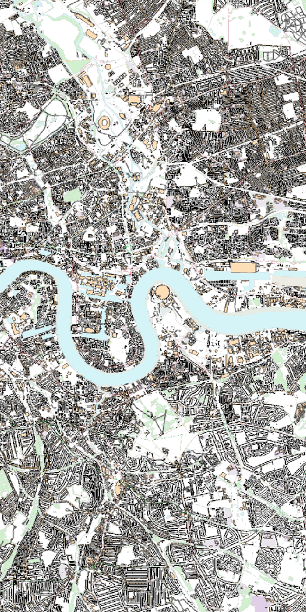

////

// page break to keep request & response together in PDF
<<<

=== Temporal subsetting

Spatial datasets are often also organized with a temporal dimension in addition to two or three spatial dimensions
(some of these datasets are sometimes called time series or datacubes).

The following example reuses the same subsetting and scaling from the earlier rectangular 1:50,000 map of London, and applies it to a Sentinel-2 collection of images.
The `datetime` parameter selects a particular day of the time series (April 1st, 2022).

https://maps.gnosis.earth/ogcapi/collections/sentinel2-l2a/map?center=0,51.5&scale-denominator=50000&datetime=2022-04-01&width=1024&height=512

[#xmp_xmp_s2l2a_center_scale,reftext='{figure-caption} {counter:figure-num}']
.A map of Sentinel-2 data from April 1st, 2022 of the same area. From: https://sentinel.esa.int/web/sentinel/missions/sentinel-2[Copernicus SENTINEL-2 operated by ESA].
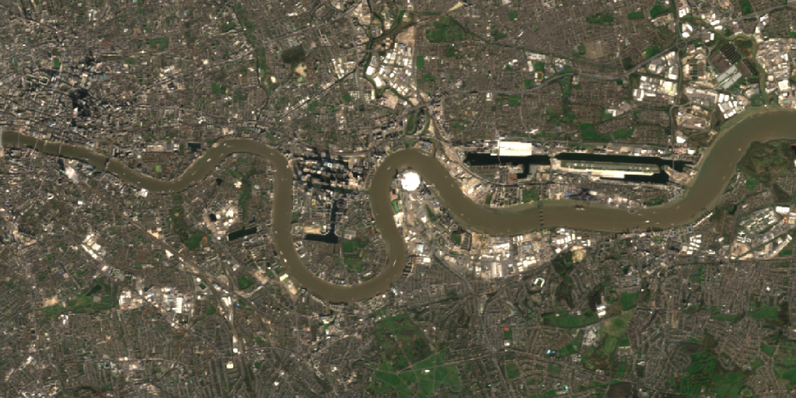

There is an equivalent notation for the previous request that uses `subset` for the _time_ axis instead of the `datetime` parameter.
This subsetting axis can also be combined within a single `subset` parameter value together with subsetting for the `Lat` and `Lon` axes, instead of using `center` and `scale-denominator`, or `bbox`.
Note that in this case, the time string should be enclosed in double quotes.

https://maps.gnosis.earth/ogcapi/collections/sentinel2-l2a/map?width=1024&height=512&subset=time(%222022-04-01%22),Lat(51.467787:51.532213),Lon(-0.103152:0.103152)["https://maps.gnosis.earth/ogcapi/collections/sentinel2-l2a/map?width=1024&height=512&subset=time(\"2022-04-01\"),Lat(51.467787:51.532213),Lon(-0.103152:0.103152)"]

// page break to keep request & response together in PDF
<<<

=== Styled maps

The following two example requests, for the same region and time of interest, illustrate two additional styles available from the same sentinel-2 datacube,
in addition to its default Red, Green, Blue natural color style. The first style, symbolizes the Scene Classification Layer categories:

https://maps.gnosis.earth/ogcapi/collections/sentinel2-l2a/styles/scl/map?center=0,51.5&scale-denominator=50000&datetime=2022-04-01&width=1024&height=512

[#xmp_xmp_s2l2a_scl,reftext='{figure-caption} {counter:figure-num}']
.A map of a scene classification layer style for Sentinel-2 data from April 1st, 2022 of London. From: https://sentinel.esa.int/web/sentinel/missions/sentinel-2[Copernicus SENTINEL-2 operated by ESA].
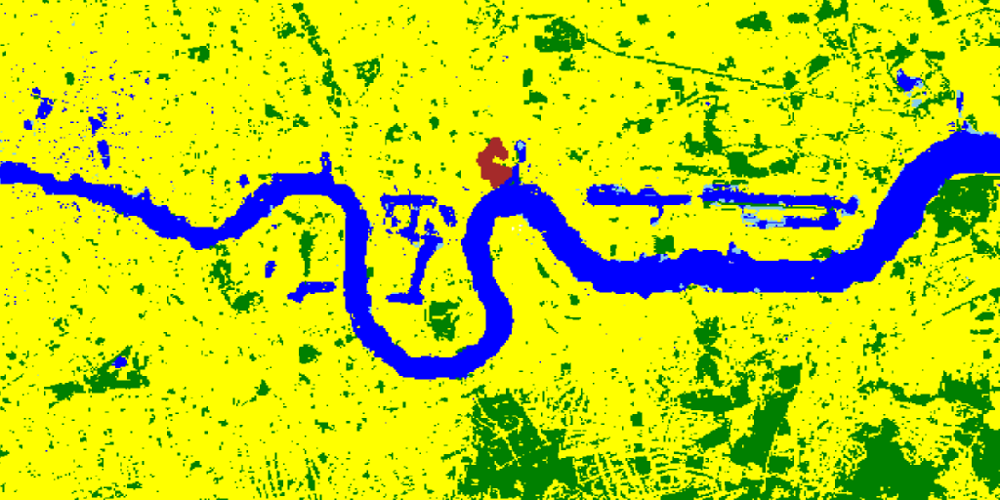

The next style, using style identifier _evi2_, represents an Enhanced Vegetation Index (EVI) calculated from bands B02 (blue), B04 (red) and B08 (near infrared):

https://maps.gnosis.earth/ogcapi/collections/sentinel2-l2a/styles/evi2/map?center=0,51.5&scale-denominator=50000&datetime=2022-04-01&width=1024&height=512

[#xmp_xmp_s2l2a_evi,reftext='{figure-caption} {counter:figure-num}']
.A map of an Enhanced Vegetation Index (EVI) style for Sentinel-2 data from April 1st, 2022 of London. From: https://sentinel.esa.int/web/sentinel/missions/sentinel-2[Copernicus SENTINEL-2 operated by ESA].
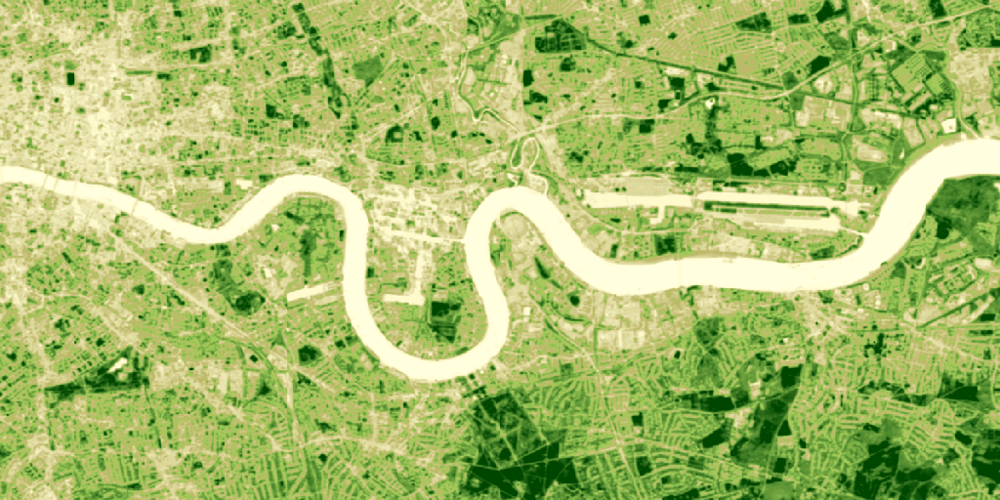

// page break to keep request & response together in PDF
<<<

The following example requests illustrate how to retrieve two different styles for a High Resolution (1 m) Digital Terrain Model (DTM) of the Red River in Manitoba, from Natural Resources Canada.
Styles with identifiers _style1_ and _style2_ are available at `.../styles/{styleId}`, through https://docs.ogc.org/DRAFTS/20-009.html[_OGC API - Styles_], and provide links to map resources.

https://maps.gnosis.earth/ogcapi/collections/HRDEM-RedRiver:DTM:1m/styles/style1/map?center=-97.06,49.937&scale-denominator=28000&height=600&width=1000

[#hrdem_redriver_style1,reftext='{figure-caption} {counter:figure-num}']
.Styled map of https://open.canada.ca/data/en/dataset/957782bf-847c-4644-a757-e383c0057995[High Resolution DTM] from Natural Resources Canada (style1)
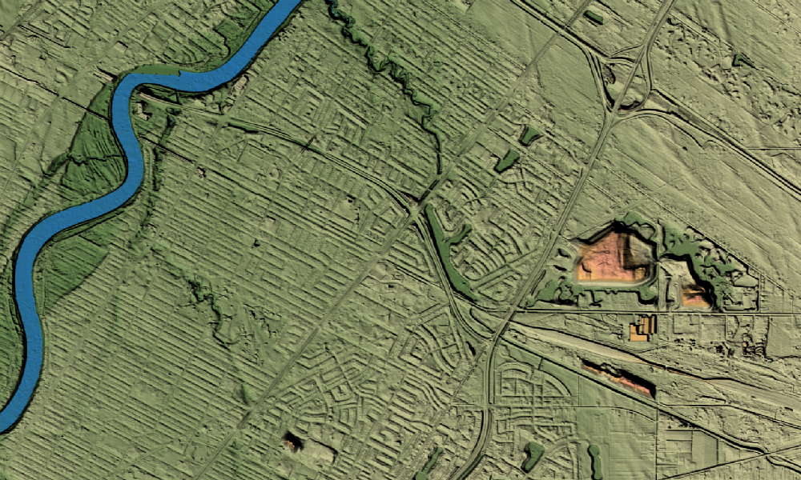

https://maps.gnosis.earth/ogcapi/collections/HRDEM-RedRiver:DTM:1m/styles/style2/map?center=-97.06,49.937&scale-denominator=28000&height=600&width=1000

[#hrdem_redriver_style2,reftext='{figure-caption} {counter:figure-num}']
.Styled map of High Resolution DTM from Natural Resources Canada, showing alternative _style2_
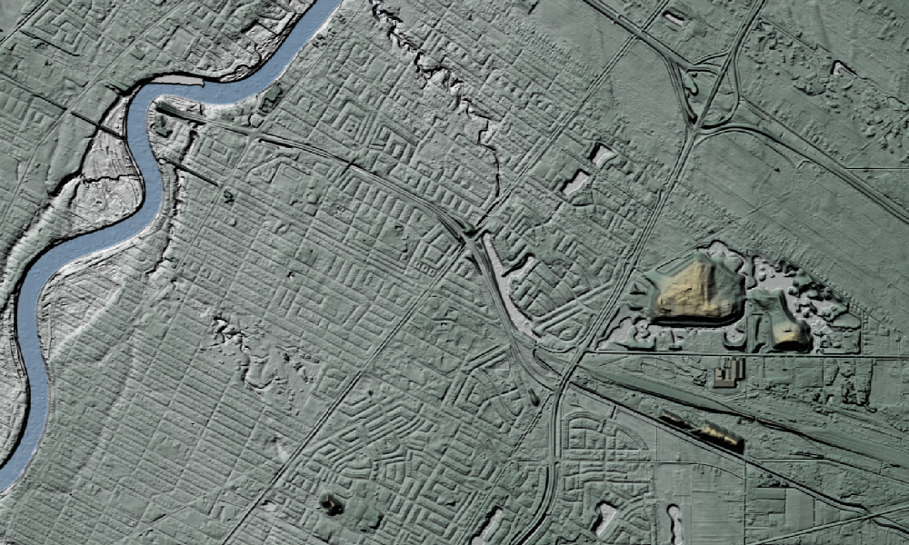

// page break to keep request & response together in PDF
<<<

=== Additional dimensions

It is also common for spatial datasets, especially for weather and climate data, to feature additional dimensions beyond space and time,
such as pressure levels, or additional time dimensions relating to forecasting. These can all be handled in a generic manner also using the `subset` parameter.
The following two example illustrates how to retrieve a map of the temperature for the whole world at _pressure_ (an extra dimension) levels of 500 and 850 hectopascals:

https://maps.gnosis.earth/ogcapi/collections/climate:cmip5:byPressureLevel:temperature/map?subset=pressure(500)&datetime=2023-07-03&bgcolor=gray

[#world_T_png,reftext='{figure-caption} {counter:figure-num}']
.A map of CMIP5 temperature data of the world at 500 hPa on July 3rd, 2023 (from https://cds.climate.copernicus.eu/cdsapp#!/dataset/projections-cmip5-daily-pressure-levels[Copernicus climate data store])

https://maps.gnosis.earth/ogcapi/collections/climate:cmip5:byPressureLevel:temperature/map?subset=pressure(850)&datetime=2023-07-03&bgcolor=gray

[#world_T_850_png,reftext='{figure-caption} {counter:figure-num}']
.A map of CMIP5 temperature data of the world at 850 hPa on July 3rd, 2023 (from https://cds.climate.copernicus.eu/cdsapp#!/dataset/projections-cmip5-daily-pressure-levels[Copernicus climate data store])
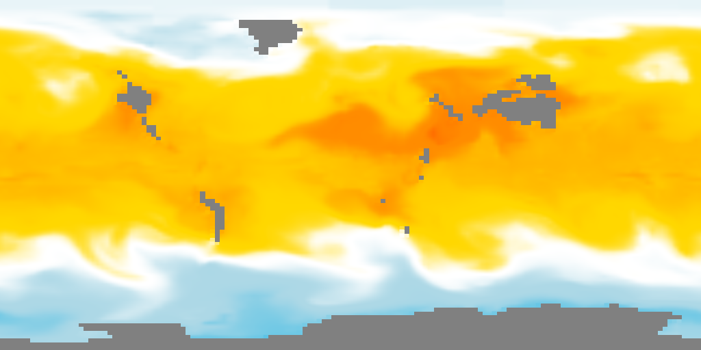

// page break to keep request & response together in PDF
<<<

The following examples illustrate how to retrieve a map of the relative humidity for the whole world at _pressure_ (an extra dimension) levels of 500 and 975 hectopascals:

https://maps.gnosis.earth/ogcapi/collections/climate:era5:relativeHumidity/map?subset=pressure(500)&datetime=2023-04-06T23:00:00Z&bgcolor=skyBlue

[#world_HR_png,reftext='{figure-caption} {counter:figure-num}']
.A map of ERA5 reanalysis data showing Relative Humidity of the whole world at 500 hPa on April 6th, 2023 at 23:00:00 UTC (from https://cds.climate.copernicus.eu/cdsapp#!/dataset/reanalysis-era5-pressure-levels[Copernicus climate data store])
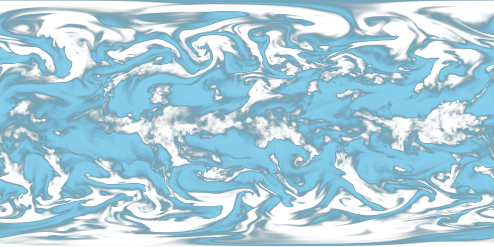

https://maps.gnosis.earth/ogcapi/collections/climate:era5:relativeHumidity/map?subset=pressure(975)&datetime=2023-04-06T23:00:00Z&bgcolor=skyBlue

[#world_HR_975_png,reftext='{figure-caption} {counter:figure-num}']
.A map of ERA5 reanalysis data showing Relative Humidity of the whole world at 975 hPa on April 6th, 2023 at 23:00:00 UTC (from https://cds.climate.copernicus.eu/cdsapp#!/dataset/reanalysis-era5-pressure-levels[Copernicus climate data store])
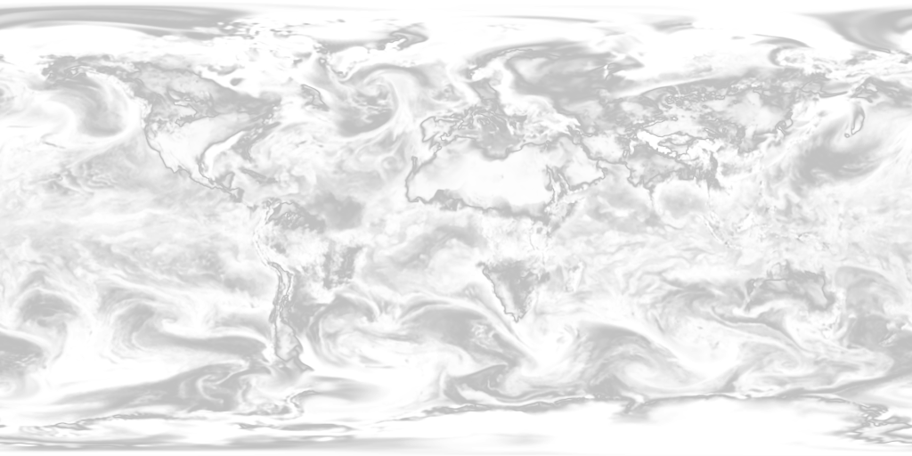

The following https://maps.gnosis.earth/ogcapi/collections/climate:era5:relativeHumidity?f=json[JSON collection description] for these relative humidity examples illustrates
how to describe the extent of multidimensional datasets, including the details of both regular and irregular grids.

An example JSON collection description response for ERA5 relative humidity is below:

[%unnumbered%]
[source,JSON]
----
{
   "id" : "climate:era5:relativeHumidity", "title" : "ERA5 Relative Humidity",
   "attribution" : "<a href='https://cds.climate.copernicus.eu/cdsapp#!/dataset/reanalysis-era5-pressure-levels'>Copernicus Climate Data Store</a>",
   "extent" : {
      "spatial" : {
         "bbox" : [ [ -180, -90, 180, 90 ] ],
         "grid" : [
            { "cellsCount" : 2049, "resolution" : 0.17578125 },
            { "cellsCount" : 1025, "resolution" : 0.17578125 }
         ]
      },
      "temporal" : {
         "interval" : [ [ "2023-04-01T00:00:00Z", "2023-04-06T23:00:00Z" ] ],
         "grid" : { "cellsCount" : 144, "resolution" : "PT1H" }
      },
      "pressure" : {
         "unit" : "hPa",
         "interval" : [ [ 1.0, 1000.0 ] ],
         "grid" : {
            "cellsCount" : 37,
            "coordinates" : [ 1.0, 2.0, 3.0, 5.0, 7.0, 10.0, 20.0,
               30.0, 50.0, 70.0, 100.0, 125.0, 150.0, 175.0, 200.0,
               225.0, 250.0, 300.0, 350.0, 400.0, 450.0, 500.0, 550.0,
               600.0, 650.0, 700.0, 750.0, 775.0, 800.0, 825.0, 850.0,
               875.0, 900.0, 925.0, 950.0, 975.0, 1000.0 ]
         }
      }
   },
   "minCellSize" : 0.17578125,
   "minScaleDenominator" : 69885283.0035897195339,
   "crs" : [
      "https://www.opengis.net/def/crs/OGC/1.3/CRS84",
      "https://www.opengis.net/def/crs/EPSG/0/4326",
      "https://www.opengis.net/def/crs/EPSG/0/3857",
      "https://www.opengis.net/def/crs/EPSG/0/3395"
   ],
   "storageCrs" : "https://www.opengis.net/def/crs/OGC/1.3/CRS84",
   "links" : [
      { "rel" : "self",
        "title" : "Information about the ERA5 Relative Humidity",
        "href" : "/ogcapi/collections/climate:era5:relativeHumidity"
      },
      { "rel" : "[ogc-rel:map]", "title" : "Default map",
        "href" : "/ogcapi/collections/climate:era5:relativeHumidity/map"
      },
      { "rel" : "[ogc-rel:tilesets-map]",
        "title" : "Map tilesets available for this collection",
        "href" : "/ogcapi/collections/climate:era5:relativeHumidity/map/tiles"
      },
      { "rel" : "[ogc-rel:styles]", "title" : "Styles for Relative Humidity",
        "href" : "/ogcapi/collections/climate:era5:relativeHumidity/styles"
      },
      { "rel" : "[ogc-rel:schema]", "title" : "Schema",
        "href" : "/ogcapi/collections/climate:era5:relativeHumidity/schema"
      },
      { "rel" : "[ogc-rel:coverage]", "title" : "Coverage for Relative Humidity",
        "href" : "/ogcapi/collections/climate:era5:relativeHumidity/coverage"
      },
      { "rel" : "[ogc-rel:tilesets-coverage]",
        "title" : "Coverage tilesets available for this collection",
        "href" : "/ogcapi/collections/climate:era5:relativeHumidity/tiles"
      }
   ]
}
----

// page break to keep request & response together in PDF
<<<

=== Coordinate Reference Systems

While introducing the selection of an alternative output Coordinate Reference System (World Mercator, EPSG:3395) to the default native CRS (`storageCRS`) returned so far (CRS84),
the following examples will zoom out significantly to a 1:20,000,000 scale. At the scales used in previous examples, the difference between those two CRSs would not be distinguishable,
since the server automatically preserve scales in both dimensions, which makes the responses for those two CRSs almost visually equivalent on a local scale.
These examples will illustrate the two CRS by requesting a map for the Blue Marble Next Generation (2004) from NASA Earth Observatory's Visible Earth,
first explicitly requesting EPSG:4326 (whose main difference from CRS84 is that axis order is Latitude, Longitude).

//https://maps.gnosis.earth/ogcapi/collections/blueMarble/map?center=0,51.5&scale-denominator=20000000&crs=%5BEPSG:4326%5D["https://maps.gnosis.earth/ogcapi/collections/blueMarble/map?center=0,51.5&scale-denominator=20000000&crs=[EPSG:4326\]"]

&#x68;&#x74;&#x74;&#x70;&#x73;&#x3A;//maps.gnosis.earth/ogcapi/collections/blueMarble/map?center=0,51.5&scale-denominator=20000000&crs=&#x5B;EPSG:4326&#x5D;

Notice that the response header now includes the `Content-Crs:` header, and that the `Content-Bbox:` axis order now follows the latitude, longitude order:

[%unnumbered%]
[source]
----
Content-Crs: <https://www.opengis.net/def/crs/EPSG/0/4326>
Content-Bbox: 25.729221,-28.573112,77.270779,28.573112
----

[#xmp_map_blueMarble_4326,reftext='{figure-caption} {counter:figure-num}']
.Map of https://earthobservatory.nasa.gov/features/BlueMarble[NASA Earth Observatory's Blue Marble Next Generation (2004)], in Plate Carrée (EPSG:4326) output `crs`
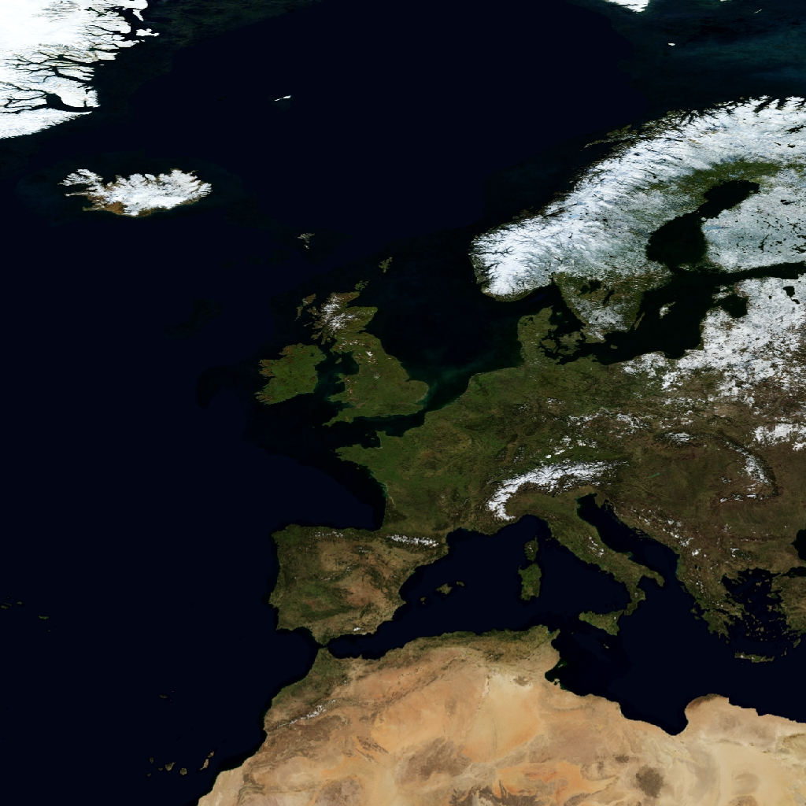

// page break to keep request & response together in PDF
<<<

Now EPSG:3395 can be requested instead using:

//https://maps.gnosis.earth/ogcapi/collections/blueMarble/map?center=0,51.5&scale-denominator=20000000&crs=%5BEPSG:3395%5D["https://maps.gnosis.earth/ogcapi/collections/blueMarble/map?center=0,51.5&scale-denominator=20000000&crs=[EPSG:3395\]"]

&#x68;&#x74;&#x74;&#x70;&#x73;&#x3A;//maps.gnosis.earth/ogcapi/collections/blueMarble/map?center=0,51.5&scale-denominator=20000000&crs=&#x5B;EPSG:3395&#x5D;

[#xmp_map_blueMarble_3395,reftext='{figure-caption} {counter:figure-num}']
.Map of NASA Earth Observatory's Blue Marble Next Generation (2004), using World Mercator (EPSG:3395) output `crs`
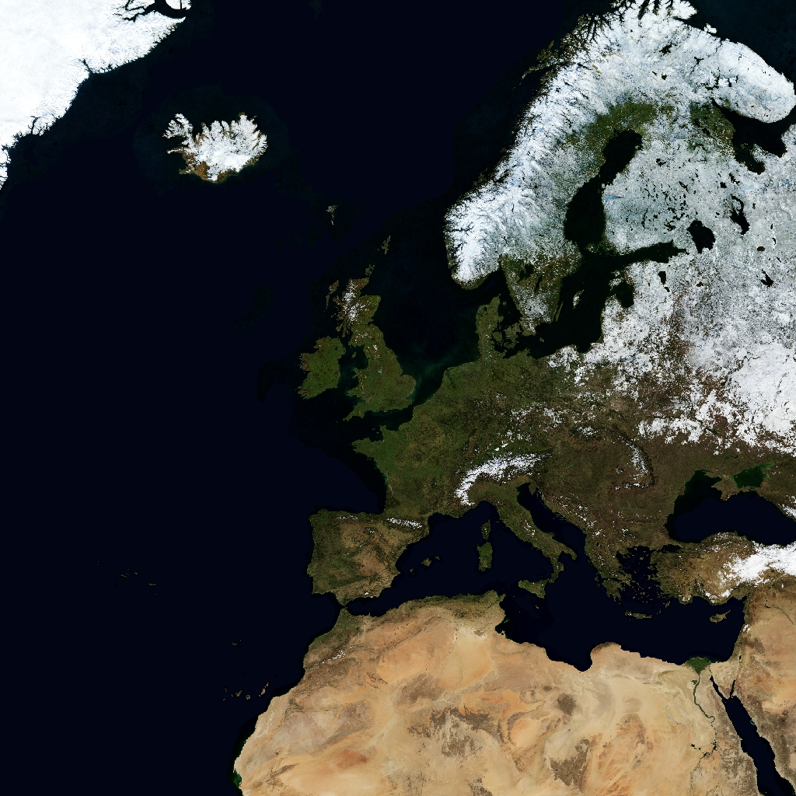

The `Content-Crs:` contains the coordinates of the bounding box selected from the requested scale and default dimensions, which can be used to make a request that will generate an equivalent response.

[%unnumbered%]
[source]
----
Content-Crs: <https://www.opengis.net/def/crs/EPSG/0/3395>
Content-Bbox: -4596385.263861,2080129.089271,4596385.263861,11273386.415933
----

In order to also specify the bounding box in that EPSG:3395 CRS, the following request also makes use of the `bbox-crs` parameter, which otherwise always defaults to CRS84 (regardless of the native CRS or selected output CRS).

//https://maps.gnosis.earth/ogcapi/collections/blueMarble/map?bbox-crs=%5BEPSG:3395%5D&bbox=-4596385.263861,2080129.089271,4596385.263861,11273386.415933&crs=%5BEPSG:3395%5D["https://maps.gnosis.earth/ogcapi/collections/blueMarble/map?bbox-crs=[EPSG:3395\]&bbox=-4596385.263861,2080129.089271,4596385.263861,11273386.415933&crs=[EPSG:3395\]"]

&#x68;&#x74;&#x74;&#x70;&#x73;&#x3A;//maps.gnosis.earth/ogcapi/collections/blueMarble/map?bbox-crs=%5BEPSG:3395%5D&bbox=-4596385.263861,2080129.089271,4596385.263861,11273386.415933&crs=&#x5B;EPSG:3395&#x5D;

// page break to keep request & response together in PDF
<<<

[[dimensions-calculation-examples]]
=== Calculations to infer appropriate dimensions

In these examples, the client specifies a bounding box (using `bbox` or `subset`) from 30°N to 50°N and 0°E to 30°E and a `scale-denominator` of 1:10,000,000.
The server needs to compute appropriate map image dimensions from these parameters that are provided (no default dimensions or center are used).
The default 0.28 mm/pixel display resolution is used since `mm-per-pixel` is not specified.
Two examples are given, one in a geographic Plate Carrée CRS (EPSG:4326) and one in a projected World Mercator CRS (EPSG:3395)
(which uses a bounding box of the same geographic area transformed into coordinates in that CRS).

Regardless of the CRS, the number of physical meters that each pixel should represent can be computed with:

[%unnumbered%]
[source]
----
physicalMetersPerPixel = (mm-per-pixel / 1000 mm/m) * scale-denominator
physicalMetersPerPixel = (0.28 mm/pix / 1000 mm/m) * 10,000,000 = 2800 m/pix
----

==== Plate Carrée (EPSG:4326) Example

The first example is for an EPSG:4326 Plate Carrée CRS.

[%unnumbered%]
[source]
----
GET /collections/blueMarble/map?
   subset=Lat(30:50),Lon(0:30)&
   scale-denominator=10000000&
   crs=[EPSG:4326]

GET /collections/blueMarble/map?
   bbox=0,30,30,50&
   scale-denominator=10000000&
   crs=[EPSG:4326]
----

The latitude delta is 20°, whereas the longitude delta is 30°.

The implementation could assume the WGS84 111,319.49 meters / degree of latitude (`metersPerDegLat` below), and use the most equatorial latitude of the subset (30°N) to
compute the numbers of meters / degree of longitude with:

[%unnumbered%]
[source]
----
metersPerDegLon = metersPerDegLat * cos(mostEquatorialLat)
metersPerDegLon = 111,319.49 m/deg * cos(30°) = 96,405.51 m/deg
----

The dimensions can then simply be computed (rounding to the nearest integer) with:

[%unnumbered%]
[source]
----
width  = deltaLon * metersPerDegLon / physicalMetersPerPixel
height = deltaLat * metersPerDegLat / physicalMetersPerPixel

width  = 30 deg *  96,405.51 m/deg / 2800 m/pix = 1033 pixels
height = 20 deg * 111,319.49 m/deg / 2800 m/pix =  795 pixels
----

==== World Mercator (EPSG:3395) Example

This second example is for the same geographical area, but for an EPSG:3395 World Mercator CRS instead.

[%unnumbered%]
[source]
----
GET /collections/blueMarble/map?
   subset=E(0:3339584.72),N(3482189.09:6413524.59)&
   scale-denominator=10000000&
   subset-crs=[EPSG:3395]&
   crs=[EPSG:3395]

GET /collections/blueMarble/map?
   bbox=0,3482189.09,3339584.72,6413524.59&
   scale-denominator=10000000&
   crs=[EPSG:3395]&
   bbox-crs=[EPSG:3395]
----

The easting delta is 3,339,584.72, whereas the northing delta is 2,931,335.50.

To correctly apply the scale, the ratio between CRS units and physical meters must be considered. 
This could be calculated for the center point: (E: 1,669,792.36, N: 4,947,856.84) which corresponds to (40.7514917°N, 15°E).
One approach could be to project two points 1 degree of longitude apart around the center point,
using the implementation's projection library, to obtain the number of CRS units per degree of longitude.
Transforming (40.7514917°N, 14.5°E) to EPSG:3395 yields (E: 1,614,132.62, N: 4,947,856.85) and transforming (40.7514917°N, 15.5°E) yields (E: 1,725,452.11, N: 4,947,856.85).
The resulting easting delta (`oneDegEastingDelta` below) is 111,319.49, which in this case can be recognized as the actual physical meters per degree at the equator, rather than at the center latitude used.
Therefore, in this case implementations effectively needs to apply the reverse correction that had to be applied for Plate Carrée when considering the numbers of true meters per Easting unit.
First, `metersPerDegLon` can be computed as in the previous example:

[%unnumbered%]
[source]
----
metersPerDegLon = metersPerDegLat * cos(centerLat)
metersPerDegLon = 111,319.49 m/deg * cos(40.7514917°) = 84,329.856 m/deg
----

Then the meters per easting unit can be computed:

[%unnumbered%]
[source]
----
metersPerEastingUnit = metersPerDegLon / oneDegEastingDelta
metersPerEastingUnit = 84,329.856 m/deg / 111,319.49 m/deg = 0.75754799
----

Notice that in this particular case of World Mercator, this is simply:

[%unnumbered%]
[source]
----
metersPerEastingUnit = cos(centerLat)
metersPerEastingUnit = cos(40.7514917°) = 0.75754799
----

The implementation could also apply similar logic to compute the meters per northing unit:

[%unnumbered%]
[source]
----
metersPerNorthingUnit = metersPerDegLat / oneDegNorthingDelta
----

However, in the case of World Mercator, it could simply assume that `metersPerNorthingUnit` is equal to `metersPerEastingUnit`.

Finally, the map image dimensions can be computed with:

[%unnumbered%]
[source]
----
width  = deltaEasting  * metersPerEastingUnit  / physicalMetersPerPixel
height = deltaNorthing * metersPerNorthingUnit / physicalMetersPerPixel

width  = 3,339,584.72 m * 0.75754799 / 2800 m/pix = 904 pixels
height = 2,931,335.50 m * 0.75754799 / 2800 m/pix = 793 pixels
----

[[bbox-calculation-examples]]
=== Calculations to infer appropriate bounding boxes

In these examples, the client specifies a `center`, a `scale-denominator`, and optionally `width` and / or `height` dimensions.
If either the `width` or `height` is not specified, the server could pick default values, such as making the missing dimension
equal to the one provided or selecting default values.
The examples will assume that the client explicitly requested a 1024 x 768 map at a 1:10,000,000 scale for a location centered on (41.8902°N, 12.4922°E).

To compute the extent in CRS units, first the physical meters per pixel can be computed using the same formula as earlier (and same result in this case):

[%unnumbered%]
[source]
----
physicalMetersPerPixel = (mm-per-pixel / 1000 mm/m) * scale-denominator
physicalMetersPerPixel = (0.28 mm/pix / 1000 mm/m) * 10,000,000 = 2800 m/pix
----

==== Plate Carrée (EPSG:4326) Example

This first example requests a map in an EPSG:4326 output CRS, using that same CRS for specifying the center as well:

[%unnumbered%]
[source]
----
GET /collections/blueMarble/map?
   center=41.8902,12.4922&
   center-crs=[EPSG:4326]&
   scale-denominator=10000000&
   crs=[EPSG:4326]&
   width=1024&
   height=768
----

A simple approach to computing the bounding box is to extend away from the center in both directions by the distance in CRS units corresponding to half the respective pixel dimension.

To consider the latitude of the subsets for computing the longitude extent, the latitude extent will be computed first, using the inverse of the earlier height computation:

[%unnumbered%]
[source]
----
deltaLat = height * physicalMetersPerPixel / metersPerDegLat
deltaLat = 768 pix * 2800 m/pix / 111,319.49 m/deg = 19.317372 degrees
----

A constant 111,319.49 meters / degree of latitude is assumed here again, rather than the more accurate polynomial equation taking into consideration the ellipsoid eccentricity mentioned earlier,
which would yield slightly different results.

The lower and upper latitudes of the bounding can then be easily computed by adding and subtracting half this delta to the requested center latitude:

[%unnumbered%]
[source]
----
lowerLat = 41.8902°N - 19.317372 deg / 2 = 32.231514°N
upperLat = 41.8902°N + 19.317372 deg / 2 = 51.548886°N
----

From this, the most equatorial latitude can be established to be 32.231514°N, which can then be used to compute the meters per degrees of longitude, exactly like for the dimension computation examples:

[%unnumbered%]
[source]
----
metersPerDegLon = metersPerDegLat * cos(mostEquatorialLat)
metersPerDegLon = 111,319.49 m/deg * cos(32.231514°) = 94,165.15 m/deg
----

and the longitude delta can then be computed similarly:

[%unnumbered%]
[source]
----
deltaLon = width * physicalMetersPerPixel / metersPerDegLon
deltaLon = 1024 pix * 2800 m/pix / 94,165.15 m/deg = 30.448632 degrees
----

and from this the left (West) and right (East) longitude bounds:

[%unnumbered%]
[source]
----
leftLon  = 12.4922°E - 30.448632 deg / 2 =  2.732116°W
rightLon = 12.4922°E + 30.448632 deg / 2 = 27.716516°E
----

which completes the bounding box calculation. Expressed in the default CRS84 (longitude, latitude) order, the `bbox` parameter would be:

`bbox=-2.732116,32.231514,27.716516,51.548886`.

==== World Mercator (EPSG:3395) Example

This second example requests a map in an EPSG:3395 output CRS, using that same CRS for specifying the center as well:

[%unnumbered%]
[source]
----
GET /collections/blueMarble/map?
   center=1390625.34,5116008.23&
   center-crs=[EPSG:3395]&
   scale-denominator=10000000&
   crs=[EPSG:3395]&
   width=1024&
   height=768
----

The center corresponds to the same point as the previous example (41.8902°N, 12.4922°E).

Using the same approach as for the earlier dimension computation examples, transforming test points one degree apart, the number of physical meters per easting and northing units can be computed
specifically for the requested center point (E: 1390625.34, N: 5116008.23).
Like earlier, in the specific case of World Mercator the `oneDegEastingDelta` and `oneDegNorthingDelta` is constant at 111,319.49 m/deg,
which corresponds to the number of meters per degree at the equator.
The number of physical meters per degree of longitude at the center latitude (41.8902°N) can be computed in the same way as previous examples:

[%unnumbered%]
[source]
----
metersPerDegLon = metersPerDegLat * cos(centerLat)
metersPerDegLon = 111,319.49 m/deg * cos(41.8902°) = 82,869.096 m/deg
----

Then the meters per easting unit can be computed:

[%unnumbered%]
[source]
----
metersPerEastingUnit = metersPerDegLon / oneDegEastingDelta
metersPerEastingUnit = 82,869.096 m/deg / 111,319.49 m/deg = 0.74442576
----

Again, in the case of World Mercator, this is simply:

[%unnumbered%]
[source]
----
metersPerEastingUnit = cos(centerLat)
metersPerEastingUnit = cos(41.8902°) = 0.74442576
----

The implementation could also apply similar logic to compute the meters per northing unit:

[%unnumbered%]
[source]
----
metersPerNorthingUnit = metersPerDegLat / oneDegNorthingDelta
----

And again, in this case it could simply assume that `metersPerNorthingUnit` is equal to `metersPerEastingUnit`.

Then the delta easting and northing can be computed using the inverse of the equations used for computing dimensions:

[%unnumbered%]
[source]
----
deltaEasting  = width  * physicalMetersPerPixel / metersPerEastingUnit
deltaNorthing = height * physicalMetersPerPixel / metersPerNorthingUnit

deltaEasting  = 1024 pix * 2800 m/pix / 0.74442576 = 3,851,559.355 m
deltaNorthing =  768 pix * 2800 m/pix / 0.74442576 = 2,888,669.516 m
----

and finally this bounding box can be extended away from the requested center point (E: 1,390,625.34, N: 5,116,008.23 ):

[%unnumbered%]
[source]
----
leftEasting   = 1,390,625.34 - 3,851,559.355 / 2 =  -535,154.34
lowNorthing   = 5,116,008.23 - 2,888,669.516 / 2 = 3,671,673.47
rightEasting  = 1,390,625.34 + 3,851,559.355 / 2 = 3,316,405.02
upperNorthing = 5,116,008.23 + 2,888,669.516 / 2 = 6,560,342.99
----

which completes the bounding box calculation. Expressed in EPSG:3395 together with the required `bbox-crs`, the parameters would be:

`bbox=-535154.34,3671673.47,3316405.02,6560342.99&bbox-crs=[EPSG:3395]`.
