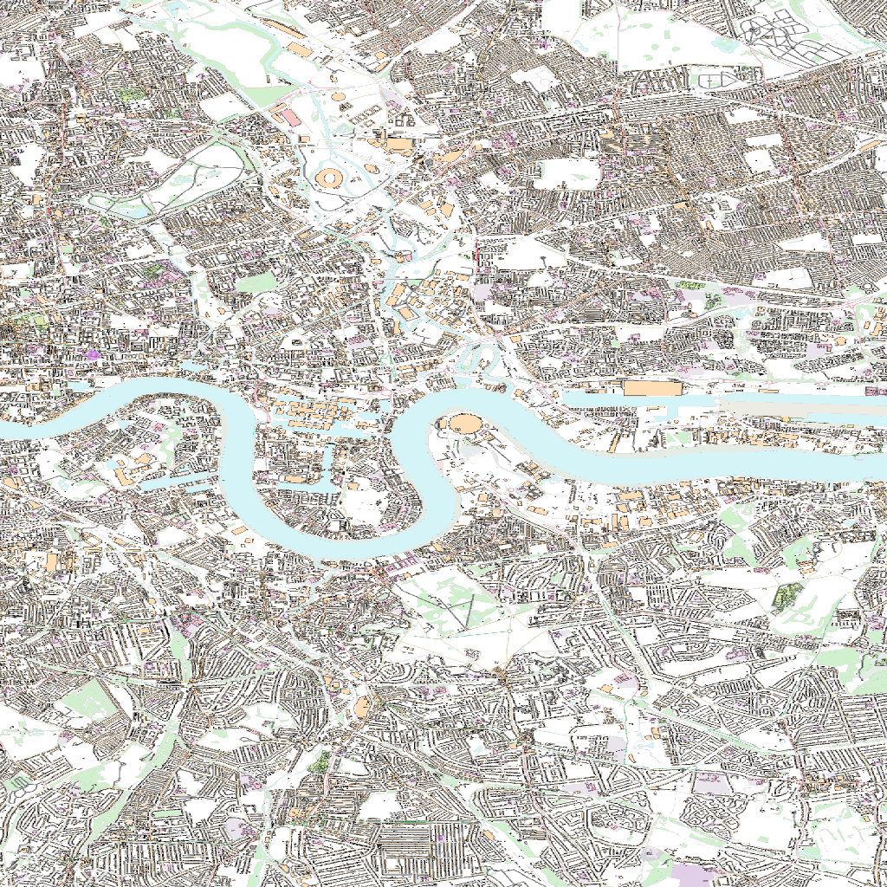
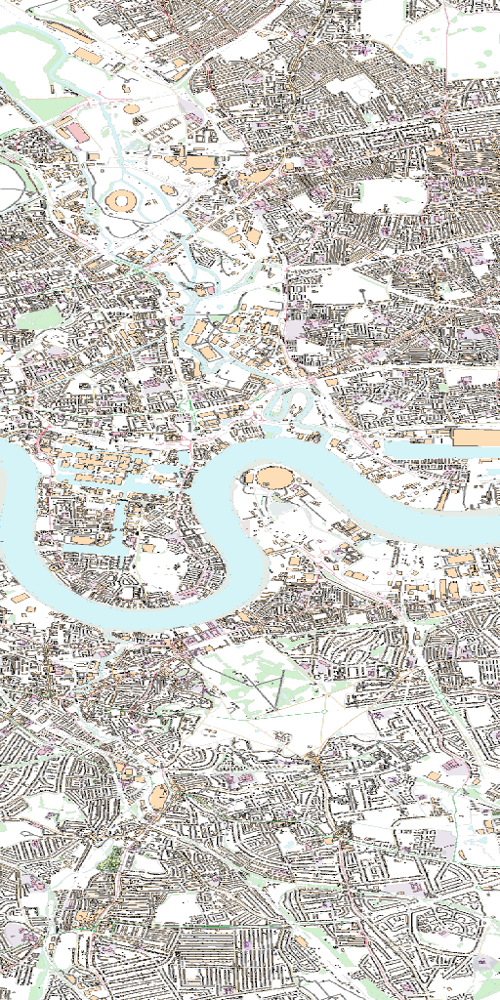

[appendix]
:appendix-caption: Annex
[[annex_examples]]
== Examples (informative)
This annex provides a set of examples that illustrate requests to get maps from an API, and how the responses look like.

The first example shows the response of a map endpoint with a request with no parameters (https://maps.gnosis.earth/ogcapi/collections/OpenMapLocal/map)

The server is free to respond any `bbox` and any `width` and `height`. In this case the server default behaviour is to render the whole UK in a 1024x448 pixels canvas. The headers of the response provide additional information on the `bbox` and the `crs` of the image. 

[#img_xmp_map_no_param,reftext='{figure-caption} {counter:figure-num}']
.UK Ordinance Survey data served as a map without specifying any parameter.
image::images/xmp_map_no_param.png[width=300,align="center"]

In the following image, we show the response of a map endpoint with a request containing only a center point parameter next to The O2 (formerly known as the Millenium Dome) (https://maps.gnosis.earth/ogcapi/collections/OpenMapLocal/map?center=0,51.5)

The server interprets the coordinates as CRS84 and decides to respond with low scale denominator (High level of detail) and with reasonable `width` and `height` (512x1024 pixels). The headers of the response provide additional information on the `bbox` and the `crs` of the image. 

[#xmp_map_center,reftext='{figure-caption} {counter:figure-num}']
.UK Ordinance Survey data close to The O2 dome..
image::images/xmp_map_center.png[width=600,align="center"]

In the following image, we show the response of a map endpoint with a request containing the same center point parameter than before but requesting a more general scale denominator: https://maps.gnosis.earth/ogcapi/collections/OpenMapLocal/map?center=0,51.5&scale-denominator=50000

[#xmp_map_center_scale,reftext='{figure-caption} {counter:figure-num}']
.UK Ordinance Survey data close to The O2 dome.
image::images/xmp_map_center_scale.png[width=600,align="center"]

The server with the same `width` and `height` (512x1024 pixels) but it gives us a more general view of the center of London. The headers of the response provide additional information on the `bbox` of the image. 

We can now force a square image of 1024x1024 pixels by specifying the `height` of the image.
https://maps.gnosis.earth/ogcapi/collections/OpenMapLocal/map?center=0,51.5&scale-denominator=50000&height=1024

[#xmp_map_center_scale_h,reftext='{figure-caption} {counter:figure-num}']
.UK Ordinance Survey data centered in the O2 dome.

The server will be free to act otherwise but it returns the an image with the same width than before.

We can now force the `width` of the image to 512 and keep the rest of the parameter.
https://maps.gnosis.earth/ogcapi/collections/OpenMapLocal/map?center=0,51.5&scale-denominator=50000&height=1024&width=1500

[#xmp_map_center_scale_hw,reftext='{figure-caption} {counter:figure-num}']
.UK Ordinance Survey data centered in the O2 dome.

The fact that the default value of `mm-per-pixel` is defined 0.28mm completely define the information necessary to make the subsetting and scaling completely predictable by the client. However, the headers will still contain this information as a back up. 

Sometimes the information is structured in a datacube and it is necessary to specify the value of other dimensions such the time in a temporal series. 

The following example reuses the same subsetting and scaling and applies it to a Sentinel 2 collection of images. The `datetime` parameter select a particular day of the time series (April the 1st, 2022). https://maps.gnosis.earth/ogcapi/collections/sentinel2-l2a/map?center=0,51.5&scale-denominator=50000&datetime=2022-04-01

[#xmp_xmp_s2l2a_center_scale,reftext='{figure-caption} {counter:figure-num}']
.A Sentinel 2 image from April the 1st, 2022 of the same area
image::images/xmp_s2l2a_center_scale.png[width=600,align="center"]
