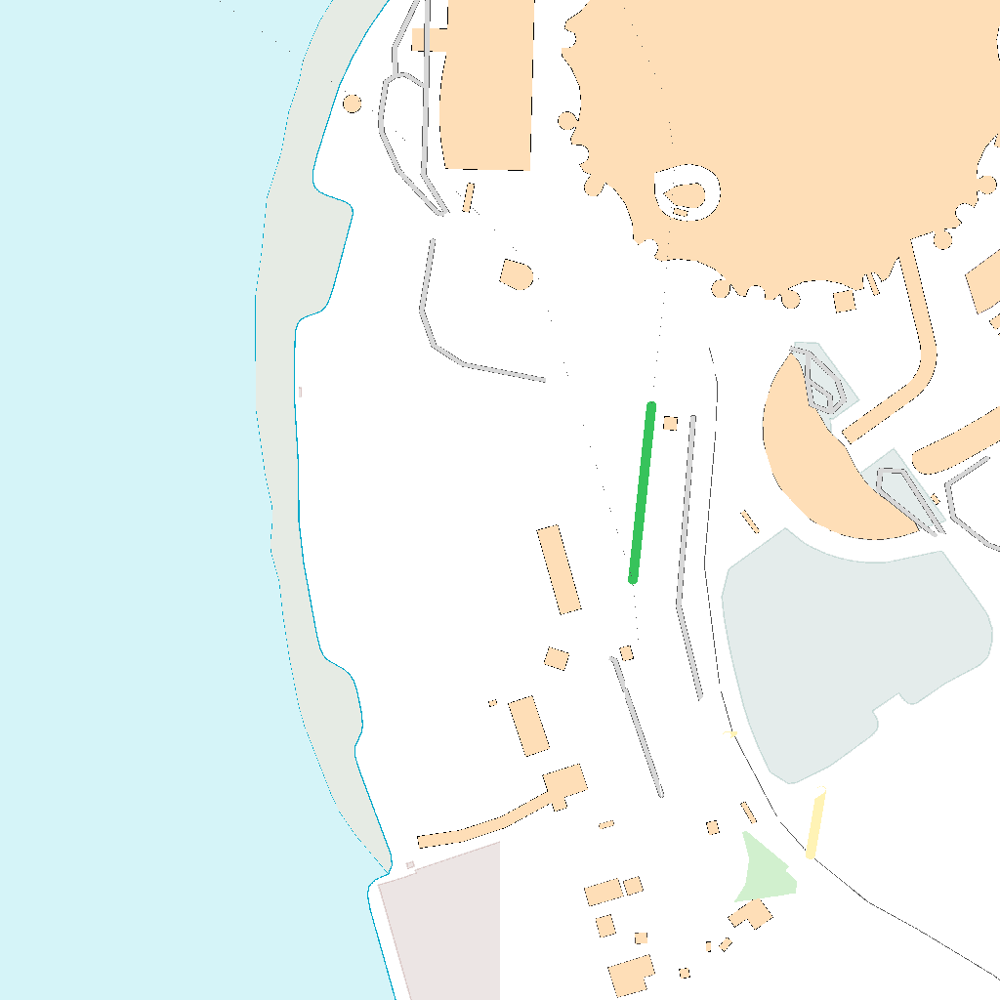
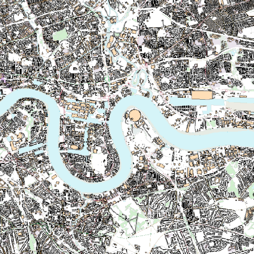

[appendix]
:appendix-caption: Annex
[[annex_examples]]
== Examples (informative)
This annex provides a set of examples that illustrate requests to get maps from an API, and how the responses look like.

The first example shows the response of a map endpoint with a request with no parameters (https://maps.gnosis.earth/ogcapi/collections/OpenMapLocal/map).

The server is free to respond with any `bbox` and any `width` and `height`.
In this case the server default behaviour is to render the whole of Great Britain in a 448x1024 pixels canvas.

[#img_xmp_map_no_param,reftext='{figure-caption} {counter:figure-num}']
.Great Britain data served as a map without specifying any parameter. From: https://www.ordnancesurvey.co.uk/products/os-open-map-local[OS OpenMap - Local], by the Ordnance Survey.
image::images/xmp_map_no_param.png[width=300,align="center"]

The headers of the response provide additional information on the bounding box (`Content-Bbox`) and the CRS of the image (`Content-Crs` is omitted here, indicating the default CRS84).

----
HTTP/1.1 200 OK
Content-Type: image/png
Content-Bbox: -8.756498,49.814737,1.848147,60.948016
Content-Length: 453751
----

The following examples are going to be centered on The O2 (formerly known as the Millenium Dome) shown here in a night aerial picture.

[#o2_dome,reftext='{figure-caption} {counter:figure-num}']
.The O2 dome peninsula (image captured from a plane by an editor of this standard while working on this annex)
image::images/O2_dome.jpg[width=600,align="center"]

// page break to keep request & response together in PDF
<<<

The following map request only specifies a `center` point parameter next to the O2 Dome:

https://maps.gnosis.earth/ogcapi/collections/OpenMapLocal/map?center=0,51.5

The server interprets the coordinates as CRS84 and decides to respond with a low scale denominator (high level of detail) suitable for the dataset and with reasonable default `width` and `height` (1024x1024 pixels).
The response is shown in the following image.

[#xmp_map_center,reftext='{figure-caption} {counter:figure-num}']
.Map of OS OpenMap - Local close to The O2 dome, specifying `center` at 51.5°N, 0°E
image::images/xmp_map_center.png[width=600,align="center"]

The headers of the response provide additional information on the bounding box (`Content-Bbox`).
Since the `Content-Crs` is not specified in this case, the client can assume CRS84.

----
HTTP/1.1 200 OK
Content-Type: image/png
Content-Bbox: -0.005493,51.494507,0.005493,51.505493
----

The following request is equivalent, using the value of that `Content-Bbox` as the value for the `bbox` parameter instead of using `center`, explicitly specifying the same `width` and `height` dimensions as those
default values chosen by the server for the above request:

https://maps.gnosis.earth/ogcapi/collections/OpenMapLocal/map?bbox=-0.005493,51.494507,0.005493,51.505493&width=1024&height=1024

There is also an equivalent notation for the previous request that uses `subset` instead of `bbox`:

https://maps.gnosis.earth/ogcapi/collections/OpenMapLocal/map?subset=Lat(51.494507:51.505493),Lon(-0.005493:0.005493)&width=1024&height=1024

// page break to keep request & response together in PDF
<<<

Next, we demonstrate the use of the `crs` parameter to select World Mercator (EPSG:3395) as an alternative output Coordinate Reference System,
instead of the default output CRS which corresponds to the native CRS (`storageCRS`), CRS84 in this case.
In order to also specify a bounding box in that CRS, the following request makes use of the `bbox-crs` parameter, which otherwise always defaults to CRS84 (regardless of the native CRS or selected output CRS).

https://maps.gnosis.earth/ogcapi/collections/OpenMapLocal/map?bbox-crs=%5BEPSG:3395%5D&bbox=-611.496226,6676146.257264,611.496226,6677369.249717&crs=%5BEPSG:3395%5D["https://maps.gnosis.earth/ogcapi/collections/OpenMapLocal/map?bbox-crs=[EPSG:3395\]&bbox=-611.496226,6676146.257264,611.496226,6677369.249717&crs=[EPSG:3395\]"]

As seen in the image response below, the shapes are less distorted than they were before, when the CRS84 default (the native CRS) was used,
and the bounding box has been adjusted slightly, bringing the top of The O2 dome partially outside the top of the map.

[#xmp_map_center_crs,reftext='{figure-caption} {counter:figure-num}']
.Map of OS OpenMap - Local close to The O2 dome, using World Mercator (EPSG:3395) output `crs`

// page break to keep request & response together in PDF
<<<

The following request specifies the same `center` point parameter as before, but specifies a more general scale denominator:

https://maps.gnosis.earth/ogcapi/collections/OpenMapLocal/map?center=0,51.5&scale-denominator=50000

[#xmp_map_center_scale,reftext='{figure-caption} {counter:figure-num}']
.Map OS OpenMap - Local centered on The O2 dome at 1:50,000 scale using `scale-denominator`
image::images/xmp_map_center_scale_1024x1024.png[width=600,align="center"]

The server responded with the same `width` and `height` (1024x1024 pixels) but it gives us a more general view of the center of London. The headers of the response provide additional information on the bounding box of the image.

// page break to keep request & response together in PDF
<<<

We can now request a smaller image of by specifying the `height` of the image.
https://maps.gnosis.earth/ogcapi/collections/OpenMapLocal/map?center=0,51.5&scale-denominator=50000&height=512

[#xmp_map_center_scale_h,reftext='{figure-caption} {counter:figure-num}']
.Smaller 512x512 map of OS OpenMap - Local centered on the O2 dome at 1:50,000 (smaller area)

The server would be free to act otherwise, but it automatically adjusted the width to also be 512.
Notice that in order to preserve the same specified 1:50,000 scale with a smaller image, the spatial region (bounding box) was reduced accordingly.
We could force a rectangular image by also specifying the `width` of the image to be 1024, while keeping the rest of the parameters:

https://maps.gnosis.earth/ogcapi/collections/OpenMapLocal/map?center=0,51.5&scale-denominator=50000&width=1024&height=512

[#xmp_map_center_scale_hw_1024x512,reftext='{figure-caption} {counter:figure-num}']
.Wider 1024x512 map of OS OpenMap - Local centered on the O2 dome at 1:50,000 scale
image::images/xmp_map_center_scale_hw_1024x512.png[width=600,align="center"]

// page break to keep request & response together in PDF
<<<

Or a taller image by specifying instead a `width` of 512 and a `height` of 1024:

https://maps.gnosis.earth/ogcapi/collections/OpenMapLocal/map?center=0,51.5&scale-denominator=50000&height=1024&width=512

[#xmp_map_center_scale_hw_512x1024,reftext='{figure-caption} {counter:figure-num}']
.Taller map of OS OpenMap - Local centered on the O2 dome at 1:50,000 scale
image::images/xmp_map_center_scale_hw_512x1024.png[width=300,align="center"]

For these last two requests, specifying both the `width` and `height`, the `center`, as well as the `scale-denominator`, combined with the fact that the default value of `mm-per-pixel`
is defined as 0.28mm/pixel, defines all of the parameters necessary to make the subsetting and scaling completely predictable by the client.
However, the response headers will still contain the bounding box information as a backup, and for cases where the server may decide to correct the center or bounding box due to the values being out of range.

// page break to keep request & response together in PDF
<<<

Spatial datasets are often also organized with a temporal dimension in addition to two or three spatial dimensions
(some of these datasets are sometimes called time series or datacubes).

The following example reuses the same subsetting and scaling and applies it to a Sentinel-2 collection of images. The `datetime` parameter selects a particular day of the time series (April 1st, 2022).

https://maps.gnosis.earth/ogcapi/collections/sentinel2-l2a/map?center=0,51.5&scale-denominator=50000&datetime=2022-04-01&width=1024&height=512

[#xmp_xmp_s2l2a_center_scale,reftext='{figure-caption} {counter:figure-num}']
.A map of Sentinel-2 data from April 1st, 2022 of the same area. From: https://sentinel.esa.int/web/sentinel/missions/sentinel-2[Copernicus SENTINEL-2 operated by ESA].
image::images/xmp_s2l2a_center_scale.png[width=600,align="center"]

There is an equivalent notation for the previous request that uses `subset` instead of `datetime` (note that in this case, the time string should be enclosed in double quotes):

https://maps.gnosis.earth/ogcapi/collections/sentinel2-l2a/map?center=0,51.5&scale-denominator=50000&width=1024&height=512&subset=time(%222022-04-01%22)["https://maps.gnosis.earth/ogcapi/collections/sentinel2-l2a/map?center=0,51.5&scale-denominator=50000&width=1024&height=512&subset=time(\"2022-04-01\")"]

It is also common for spatial datasets, especially for climate weather and climate data, to feature additional dimensions beyond space and time,
such as pressure levels, or additional time dimensions relating to forecasting. These can all be handled in a generic manner also using the `subset` parameter.

// page break to keep request & response together in PDF
<<<

The following example illustrates how to retrieve a map of the temperature for the whole world at a _pressure_ (an extra dimension) of 500 hpa:

https://maps.gnosis.earth/ogcapi/collections/climate:cmip5:byPressureLevel:temperature/map?subset=pressure(500)&datetime=2023-07-03

[#world_T_png,reftext='{figure-caption} {counter:figure-num}']
.A map of Copernicus CMIP5 data showing temperature of the whole world at 500 hPa on July 3rd, 2023. From: https://cds.climate.copernicus.eu/cdsapp#!/dataset/projections-cmip5-daily-pressure-levels[Copernicus climate data store].
image::images/world_T.png[width=600,align="center"]

The following example illustrates how to retrieve a map of the relative humidity for the whole world at a _pressure_ (an extra dimension) of 500 hpa:

https://maps.gnosis.earth/ogcapi/collections/climate:era5:relativeHumidity/map?subset=pressure(500)&datetime=2023-04-06T23:00:00Z

[#world_HR_png,reftext='{figure-caption} {counter:figure-num}']
.A map of Copernicus ERA5 reanalysis data showing HR of the whole world at 500 hPa on April 6th, 2023 at 23:00:00 UTC. From: https://cds.climate.copernicus.eu/cdsapp#!/dataset/reanalysis-era5-pressure-levels[Copernicus climate data store].
image::images/world_HR.png[width=600,align="center"]
