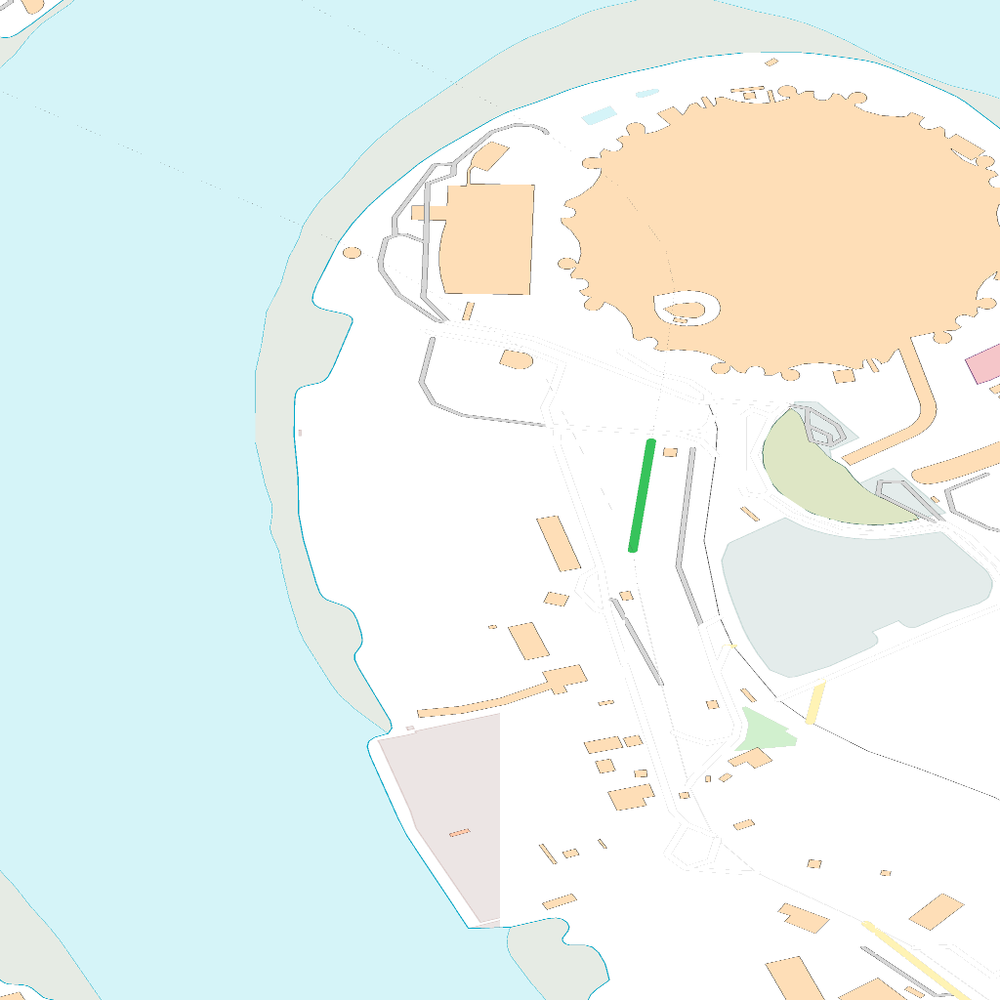
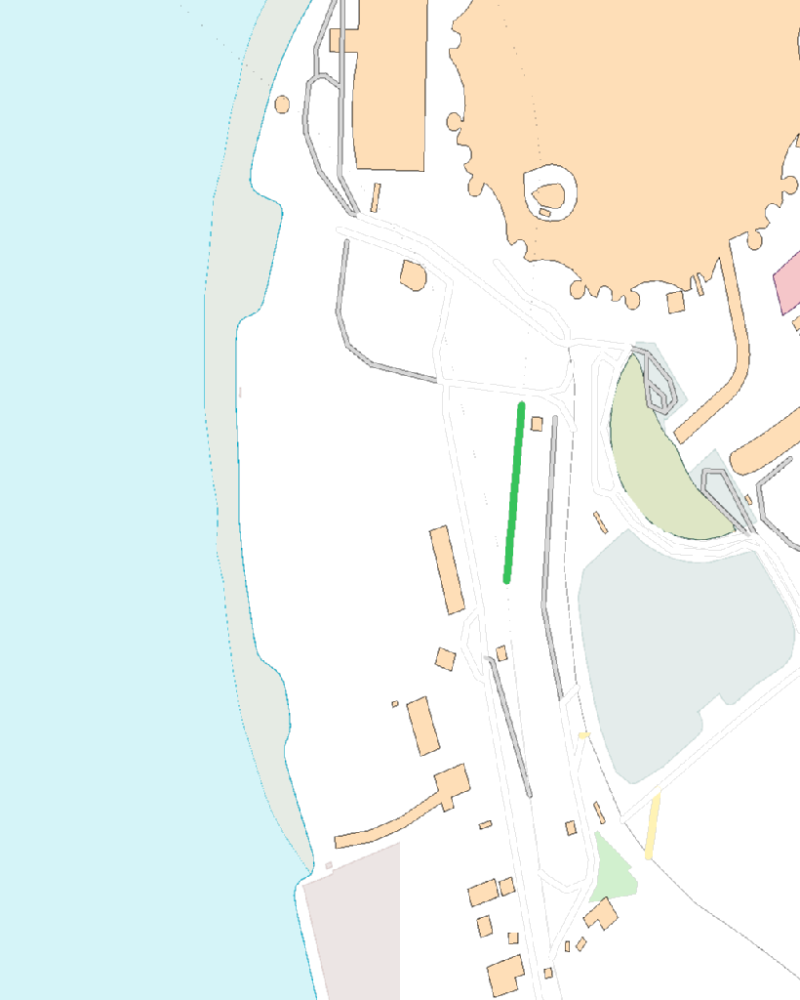

[appendix]
:appendix-caption: Annex
[[annex_examples]]
== Examples (informative)
This annex provides a set of examples that illustrate requests to get maps from an API, and how the responses look like.

The first example shows the response of a map endpoint with a request with no parameters (https://maps.gnosis.earth/ogcapi/collections/OpenMapLocal/map)

The server is free to respond any `bbox` and any `width` and `height`. In this case the server default behaviour is to render the whole UK in a 1024x448 pixels canvas. The headers of the response provide additional information on the `bbox` and the `crs` of the image. 

[#img_xmp_map_no_param,reftext='{figure-caption} {counter:figure-num}']
.Great Britain data served as a map without specifying any parameter. From: https://www.ordnancesurvey.co.uk/products/os-open-map-local[OS OpenMap - Local], by the Ordnance Survey.
image::images/xmp_map_no_param.png[width=300,align="center"]

The headers of the response contains information on the returned bounding box 
----
HTTP/1.1 200 OK
Content-Type: image/png
Content-Bbox: -8.756498,49.814737,1.848147,60.948016
Content-Length: 453751
----

The following examples are going to be centered in the The O2 (formerly known as the Millenium Dome) shown here in a night aerial picture.

[#o2_dome,reftext='{figure-caption} {counter:figure-num}']
.The O2 dome peninsula capture from a plane (taken by one of the authors of this standard)
image::images/o2_dome.jpg[width=600,align="center"]

In the following image, we show the response of a map endpoint with a request containing only a center point parameter next to the O2 Dome (https://maps.gnosis.earth/ogcapi/collections/OpenMapLocal/map?center=0,51.5)

The server interprets the coordinates as CRS84 and decides to respond with low scale denominator (High level of detail) and with reasonable `width` and `height` (512x1024 pixels). The headers of the response provide additional information on the `bbox` and the `crs` of the image. 

[#xmp_map_center,reftext='{figure-caption} {counter:figure-num}']
.OS OpenMap - Local data close to The O2 dome.
image::images/xmp_map_center.png[width=600,align="center"]

The headers of the response contains information on the returned bounding box 
----
HTTP/1.1 200 OK
Content-Type: image/png
Content-Bbox: -0.005493,51.494507,0.005493,51.505493
----

In the following image, we show the response of a map endpoint with a request containing only a bounding box parameter (https://maps.gnosis.earth/ogcapi/collections/OpenMapLocal/map?bbox=-0.005493,51.494507,0.005493,51.505493&width=1024&height=1024).

[#xmp_map_bbox,reftext='{figure-caption} {counter:figure-num}']
.OS OpenMap - Local data close to The O2 dome.

There is an equivalent notation for the previous request that uses `subset` instead of `bbox`: https://maps.gnosis.earth/ogcapi/collections/OpenMapLocal/map?subset=Lat(51.494507:51.505493),Lon(-0.005493:0.005493)&width=1024&height=1024

In the following image, we show the response of a map endpoint with a request containing only a center point parameter but requesting the response to be in the World Mercator (EPSG:3395) (https://maps.gnosis.earth/ogcapi/collections/OpenMapLocal/map?bbox-crs=%5BEPSG:3395%5D&bbox=-611.496226,6676146.257264,611.496226,6677369.249717&crs=%5BEPSG:3395%5D). The shapes in the image are less distorted than before where CRS84 was adopted as the default CRS.

[#xmp_map_center_crs,reftext='{figure-caption} {counter:figure-num}']
.OS OpenMap - Local data close to The O2 dome.

In the following image, we show the response of a map endpoint with a request containing the same center point parameter than before but requesting a more general scale denominator: https://maps.gnosis.earth/ogcapi/collections/OpenMapLocal/map?center=0,51.5&scale-denominator=50000

[#xmp_map_center_scale,reftext='{figure-caption} {counter:figure-num}']
.OS OpenMap - Local data close to The O2 dome.
image::images/xmp_map_center_scale.png[width=600,align="center"]

The server with the same `width` and `height` (512x1024 pixels) but it gives us a more general view of the center of London. The headers of the response provide additional information on the `bbox` of the image. 

We can now force a square image of 1024x1024 pixels by specifying the `height` of the image.
https://maps.gnosis.earth/ogcapi/collections/OpenMapLocal/map?center=0,51.5&scale-denominator=50000&height=1024

[#xmp_map_center_scale_h,reftext='{figure-caption} {counter:figure-num}']
.OS OpenMap - Local data centered in the O2 dome.
image::images/xmp_map_center_scale_h.png[width=600,align="center"]

The server will be free to act otherwise but it returns the an image with the same width than before.

We can now force the `width` of the image to 512 and keep the rest of the parameter.
https://maps.gnosis.earth/ogcapi/collections/OpenMapLocal/map?center=0,51.5&scale-denominator=50000&height=1024&width=512

[#xmp_map_center_scale_hw,reftext='{figure-caption} {counter:figure-num}']
.OS OpenMap - Local data centered in the O2 dome.
image::images/xmp_map_center_scale_hw.png[width=300,align="center"]

The fact that the default value of `mm-per-pixel` is defined 0.28mm completely define the information necessary to make the subsetting and scaling completely predictable by the client. However, the headers will still contain this information as a back up. 

Sometimes the information is structured in a datacube and it is necessary to specify the value of other dimensions such the time in a temporal series. 

The following example reuses the same subsetting and scaling and applies it to a Sentinel 2 collection of images. The `datetime` parameter select a particular day of the time series (April the 1st, 2022). https://maps.gnosis.earth/ogcapi/collections/sentinel2-l2a/map?center=0,51.5&scale-denominator=50000&datetime=2022-04-01

[#xmp_xmp_s2l2a_center_scale,reftext='{figure-caption} {counter:figure-num}']
.A Sentinel 2 image from April the 1st, 2022 of the same area. From: https://sentinel.esa.int/web/sentinel/missions/sentinel-2[Copernicus SENTINEL-2 operated by ESA].
image::images/xmp_s2l2a_center_scale.png[width=600,align="center"]

There is an equivalent notation for the previous request that uses `subset` instead of `datetime`: https://maps.gnosis.earth/ogcapi/collections/sentinel2-l2a/map?center=0,51.5&scale-denominator=50000&subset=time("2022-04-01")

The following example shows how to use `subset` for a extra dimension called `pressure` with 500 for the temperature for the whole world https://maps.gnosis.earth/ogcapi/collections/climate:cmip5:byPressureLevel:temperature/map?subset=pressure(500)&datetime=2023-07-03

[#world_T_png,reftext='{figure-caption} {counter:figure-num}']
.A Copernicus image showing temperature at 500 hPa from July the 3rt, 2023 of the whole world. From: https://cds.climate.copernicus.eu/cdsapp#!/dataset/reanalysis-era5-pressure-levels[Copernicus climate data store].
image::images/world_T.png[width=600,align="center"]

The following example shows how to use subset for a extra dimension called `pressure` with 500 as ºvalue for the Relative Humidi for the whole world https://maps.gnosis.earth/ogcapi/collections/climate:era5:relativeHumidity/map?subset=pressure(500)&datetime=2023-07-03

[#world_HR_png,reftext='{figure-caption} {counter:figure-num}']
.A Copernicus image showing HR at 500 hPa from July the 3rt, 2023 of the whole world. From: https://cds.climate.copernicus.eu/cdsapp#!/dataset/reanalysis-era5-pressure-levels[Copernicus climate data store].
image::images/world_HR.png[width=600,align="center"]