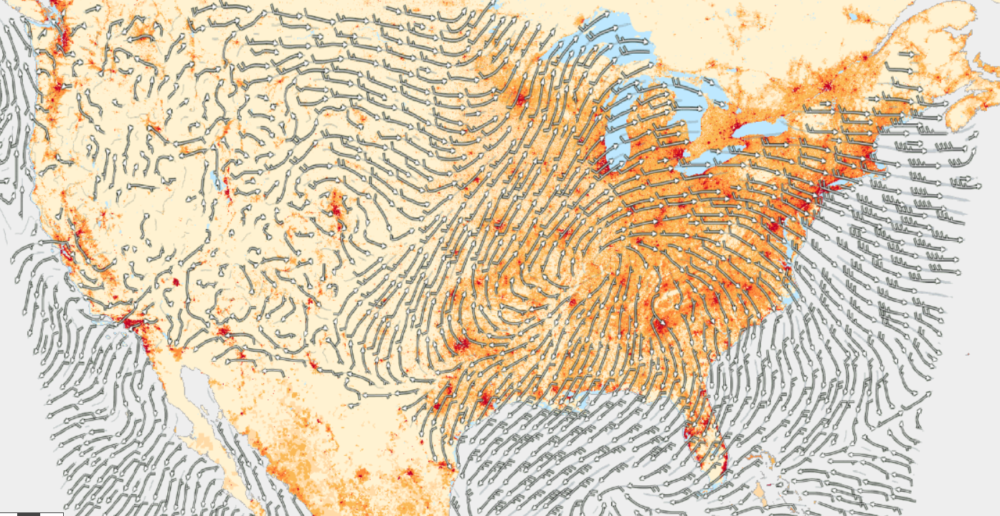

[[overview]]
== Overview

=== Introduction

The _OGC API - Maps_ Standard defines building blocks which can be used in a Web API implementation to retrieve geospatial data as maps that are visual
portrayals of the data created by applying a style to the data (see <<rc_core>>).
Maps can present the whole area of the geospatial data or a subset of the content, such as by filtering the data by extent (see <<rc_spatial-subsetting>>).
Maps can be retrieved by arbitrary extent or as tiles (see <<rc_tilesets>>). The *"Core"* conformance class is the *only mandatory one*. All other conformance classes are optional and depend on the "Core".

////
An annex with examples of map requests and responses is included as a way to learn by examples how this standard can be applied. See <<annex_examples>>.
////

An https://petstore.swagger.io/?url=https://raw.githubusercontent.com/opengeospatial/ogcapi-maps/master/openapi/ogcapi-maps-1.bundled.json[example OpenAPI definition] for this standard is available.
Details on how to adjust and bundle the https://schemas.opengis.net/ogcapi/maps/part1/1.0/openapi[modular and reusable components] used in this example OpenAPI definition can be found in <<rc_oas3>>
(while this standard is a draft, components are available https://github.com/opengeospatial/ogcapi-maps/tree/master/openapi[here]).

Services and clients are encouraged to support as many of the Coordinate Reference Systems (CRSs) as possible for all geospatial data resources to maximize
interoperability. However, this Standard does not require support for any specific CRS.

The _OGC API - Maps_ Standard does not specify any requirement for the type of _geospatial data resource_ that could be delivered as maps.
If the geospatial data resources can be organized into maps, they can be supported regardless of whether they are feature data, coverages, a resource that does not represent data per se (e.g., an annotation) and so forth.

NOTE: Geospatial data resources (e.g., collections) replace the concept of layer in WMS and WMTS.
The main difference is that layers in WMS and WMTS were not defined by other OGC APIs and did not support other functionalities.

These geospatial data resources can advertise one or more map portrayals in several resources, such as the dataset (see <<rc_dataset-map>>), a collection (see <<rc_collection-map>>), a dataset with a style, or a collection with a style (see <<rc_styled-map>>).
Other OGC APIs can provide other origins that may be represented as maps.
Accessing the _geospatial data resource_ content (other than as maps) or its descriptions is possible but out of the scope of this standard.
If a description of the _geospatial data resource_ is specified by another standard, and this description has a mechanism to add links to other resources, this standard indicates the need to add a link to a map of this resource.

The _OGC API - Maps_ Standard does not specify how to get a Web API definition, the conformance class list or the collections lists.
However, the standard assumes that the first two are defined by an OGC API standard (e.g., https://docs.ogc.org/is/19-072/19-072.html[_OGC API - Common - Part 1: Core_]) and the latter by an
OGC API for collections (e.g., https://docs.ogc.org/DRAFTS/20-024.html[_OGC API - Common - Part 2: Geospatial data_]). A similar definition is provided directly by https://docs.ogc.org/is/17-069r3/17-069r3.html[_OGC API - Features - Part 1: Core_].

This document is the first part of a series of _OGC API - Maps_ "parts" that follows the core and extensions model.
Future parts will specify other extensions, such as how to specify cartographic layout elements to be included on the map,
how to specify a filter for which elements should be included on the map, and possibly how to query information for a point in a map.

=== Map interoperability

One of the most significant use cases of the _Maps API_ is the ability to generate maps on the web that can be combined into a single view.
This standard provides a clear and common way to request a map image that covers a bounding box of interest with a defined number of pixel rows and columns.
When the _Maps API_ is implemented by different organizations that offer different collections of information, the same bounding box, in the same CRS and the same number
of rows and columns can be requested from each organization's geospatial repository.
The result is a set of images that perfectly overlap showing different variables of the same area depending on the collection of geospatial data requested.
For example, a population map can be requested to one organization (e.g., SEDAC Population Density) and weather forecast to another
(e.g., NDFD Surface Wind Velocity) in the exact same way allowing to present both together in one overlaid view or side by side.

[#table_sedan_nowcast,reftext='{figure-caption} {counter:figure-num}', cols=">a,<a", frame=none, grid=none]
.SEDAN GPWv4 Population Density, 2015 and Forecast NDFD, Surface (10m AGL) Wind Velocity (Barb, Knots)
|===
| image::images/sedan.png[width=300,align="center"]
| image::images/nowcast.png[width=300,align="center"]
|===

[#img_overlay,reftext='{figure-caption} {counter:figure-num}']
.Forecast NDFD wind speed on top of SEDAN Population density

=== How to approach an OGC API
There are at least two ways to approach an OGC API.

* Read the landing page, look for links, follow them and discover new links until the desired resource is found
* Read a Web API definition document that specifies a list of paths and path templates to resources.

For the first approach, many resources in a deployed Web API include links with _rel_ properties to document the reason and purpose for this relation. The following figure illustrates the resources as ellipses and the links as arrows with the link _rel_ as a label.

[#img_relMapTiles,reftext='{figure-caption} {counter:figure-num}']
.Resources and relations to them via links
image::images/relMapTiles.png[width=600,align="center"]

For the second approach, implementations should consider the <<rc_oas3>> which defines the use of _operationID_ suffixes, providing a mechanism to associate API paths with the requirements class that they implement.

There is a third way to approach an OGC API implementation instance that relies on assuming a set of predefined paths and path templates.
These predefined paths are used in many examples in this document and are presented together in <<table_resources>>.
It is expected that many implementations of the Maps API Standard will provide a Web API definition document (e.g., OpenAPI) using this set of predefined paths and path templates to get necessary resources directly.
All this could mislead the reader into getting the false impression that the predefined paths are enforced.
Therefore, building a client that is assuming a predefined set of paths is risky.
However, it is expected that many API implementations follow the predefined set of paths. The clients using this assumption could be successful in many occasions.
Again, be aware that these paths are not required by the Maps API Standard.

[#table_resources,reftext='{table-caption} {counter:table-num}']
.Overview of resources and common direct links that can be used to define an _OGC API - Maps_ implementation
[cols="33,66",options="header"]
!===
|Resource name                                             |Common path
|Landing page^4^                                           |`{datasetRoot}/`
|Conformance declaration^4^                                |`{datasetRoot}/conformance`
2+|*_Dataset Maps_*{set:cellbgcolor:#EEEEEE}
|Dataset maps in the default style ^1^ {set:cellbgcolor:#FFFFFF}       |`{datasetRoot}/map`
|Dataset maps^1,2^                                 |`{datasetRoot}/styles/{styleId}/map`
|Dataset map tiles^1,3^                                 |`{datasetRoot}/map/tiles/{tileMatrixSetId}/...`
2+|*_Geospatial data collections_*^5^{set:cellbgcolor:#EEEEEE}
|Collections^5^{set:cellbgcolor:#FFFFFF}                   |`{datasetRoot}/collections`
|Collection^5^                                             |`{datasetRoot}/collections/{collectionId}`
|Collection maps in the default style{set:cellbgcolor:#FFFFFF}          |`{datasetRoot}/collections/{collectionId}/map`
|Collection maps^2^                               |`{datasetRoot}/collections/{collectionId}/styles/{styleId}/map`
|Collection map tiles^3^                               |`{datasetRoot}/collections/{collectionId}/map/tiles/{tileMatrixSetId}/...`
2+|^1^ From the whole dataset or one or more geospatial resources or collections

^2^ Specified in the _OGC API - Styles_ standard

^3^ Specified in the _OGC API - Tiles Part 1: Core_ standard

^4^ Specified in the _OGC API - Common Part 1: Core_ standard

^5^ Specified in the _OGC API - Common Part 2: Geospatial data_ standard
!===

NOTE: Even though full path and full path templates in the previous table may be used in many implementations of the _OGC API - Maps_ standard, these exact paths are ONLY examples and are NOT required by this Standard. Other paths are possible if correctly described in by the Web API definition document and/or the links between resources.

=== _OGC API - Maps_ within the OGC API family

==== What is a map?

A map is a portrayal of data resulting from applying a style, usually in the form of a 2D image format such as PNG or JPEG, or in presentation formats such as SVG.
The way the styling rules of a style are applied to the data to create the portrayal is out of scope of this standard (see https://github.com/opengeospatial/ogcapi-styles[_OGC API - Styles_],
as well as specific styles and symbology standards such as https://github.com/opengeospatial/styles-and-symbology[OGC Styles & Symbology], which address this topic).

==== Implementing _OGC API - Maps_ within a Web API
A map can be delivered as a single static resource (only implementing the <<rc_core,"Core" requirement class>>), or as a dynamic service able to return different maps for arbitrary extents (implementing <<rc_spatial-subsetting, "Subsetting" requirement class>>) and/or at arbitrary scales (implementing <<rc_scaling, "Scaling" requirements class>>).
In addition, a map can also be delivered as tiles by combining _OGC API - Maps_ with some _OGC API - Tiles_ requirements classes. This approach is defined by the <<rc_tilesets, "Map Tilesets" requirements class>> of this standard,
which also correspond to _map tilesets_ described in https://docs.ogc.org/is/20-057/20-057.html[_OGC API - Tiles_], with a _map_ being a specific type of data resource for which tiles are provided.

This Standard defines building blocks that can be combined with other APIs generating or providing access to information having a geospatial component,
including the other standards of the OGC API family such as _OGC API - Tiles_ and _OGC API - Processes_. The Maps API Standard can be referenced by other standards providing resources that can be offered as maps. For example:

* https://docs.ogc.org/is/20-057/20-057.html[_OGC API - Tiles_] specifies the link relation types to access map tilesets from a dataset or collection. _OGC API - Tiles_ can also be used to serve the source data (e.g., vector features or coverage data)
* https://docs.ogc.org/DRAFTS/20-009.html[_OGC API - Styles_] defines paths to list available styles from which maps can also be accessed.
* https://docs.ogc.org/DRAFTS/21-009.html[_OGC API - Processes - Part 3: Workflows and Chaining_] provides a mechanism to trigger localized processing workflows as a result of retrieving maps (for a specific area and resolution of interest).

The origin resources to which the map resource can be attached, such as the  dataset landing page (defined by https://docs.ogc.org/is/19-072/19-072.html[_OGC API - Common - Part 1_]) and
collection (defined by https://docs.ogc.org/DRAFTS/20-024.html[_OGC API - Common - Part 2_]), may also provide access to the data used to generate the maps, alongside the Maps API capability. For example:

* https://docs.ogc.org/is/20-057/20-057.html[_OGC API - Tiles_] also specifies link relation types to access tilesets of vector and coverage data from a dataset or collection.
* https://docs.ogc.org/is/17-069r3/17-069r3.html[_OGC API - Features_] defines an API to access collections of vector features at `/collections/{collectionId}/items` and individual features at `/collections/{collectionId}/items/{itemId}`, including both geometry and properties.
* https://docs.ogc.org/DRAFTS/19-087.html[_OGC API - Coverages_] defines an API to efficiently access information organized as multi-resolution and multi-dimensional datacubes at `/collections/{collectionId}/coverage`.
Since several common parameters are shared with this Maps API, for some request formulations, it is possible to simply toggle between `/map` and `/coverage` while keeping the same parameters, to alternate between retrieving the raw data values or a server-side visualization.
* https://docs.ogc.org/is/19-086r6/19-086r6.html[_OGC API - EDR_] defines an API to retrieve spatiotemporal information using multiple query patterns such as cubes, trajectory and corridors.

But possibilities are endless: for example, a generic open data API giving access to tables, some of them with columns storing latitude and longitude, could be enhanced with OGC APIs to provide mapping capabilities.

==== Dynamic and scalable map viewers

In the OGC, the concept of a map as an image was formulated in 1998 as part of the https://portal.ogc.org/files/?artifact_id=14416[OGC Web Map Service] standards work.
At that time, the web was very young, most HTML pages were static, and JavaScript was a rudimentary programming language capable of controlling user entries in an HTML form and not much more.
In that environment, having a service capable of creating a PNG that could be embedded as a HTML page by using an IMG tag provided the first approach to static maps on the web.
Replacing the source (SRC) of the IMG tag programmatically with JavaScript, as a reaction of some user actions, provided the first approach to dynamic maps.
_GetFeatureInfo_ added a limited capability for queryable maps. However, users are now used to moving around the map by frequently doing zoom and pan operations.
If the server does not provide a very fast response, the user experience is not fluid and the map display application is perceived as not responsive enough.
One possible approach to solve this problem is to divide the viewport into tiles and request them separately.
Since tiles follow a tile matrix pattern, they can be pre-rendered in the server or cached in the Internet.
For implementing fast dynamic maps, the _OGC API - Maps_ requirement should be combined with _OGC API - Tiles_ requirements.

==== Client-side maps versus server-side maps

The _OGC API - Maps_ Standard deals with maps that are generated by the server. The client can present them with no modification.
Currently, even the smallest rendering device supports hardware rendering i.e., the transformation from geometries to pixels can be done by the GPU.
Transmitting geometries from the server commonly requires less bandwidth than transmitting the rendered map from the server and offers more flexibility pn the client-side to personalize the portrayal style.
Because of this, it is expected that _OGC API - Maps_ use cases will focus more on static maps, infrequently changing requests for dynamic maps, as well as print cartography,
whereas requesting raw data values using _OGC API - Tiles_ (e.g., Vector and Coverage Tiles) will be better suited for interactive clients presenting dynamic maps.

=== Description of the domain

The Maps API Standard defines how to describe the domain of the maps, including spatiotemporal axes as well as additional dimensions.

With the <<rc_collection-map,_Collection Map_>> requirements class, the https://github.com/opengeospatial/ogcapi-maps/blob/master/openapi/schemas/common-geodata/collectionInfo.yaml[collection description]
inherited from _OGC API - Common - Part 2_ contains an `extent` property that can describe both the spatial and temporal domain of the data. In addition, the _Unified Additional Dimensions_ common building block,
specified in the <<rc_general-subsetting,_General Subsetting_>> requirements class and used in the https://github.com/opengeospatial/ogcapi-maps/blob/master/openapi/schemas/common-geodata/extent-uad.yaml[example OpenAPI definition],
requires that additional dimensions be described in a similar way to the temporal dimension.
This allows providing an overall lower and upper bound (the first `interval` elevement), as well as optional sparse inner intervals where data is found along each dimension (additional `interval` elements).
A `grid` property also supports the description of regular and irregular grids.
The `resolution` (the distance between any two neighboring cells, an absolute value) and the number of cells (`cellsCount`) can be specified for each regular dimension.
A list of `coordinates` where data is found can be specified for irregular dimensions.
In addition, the minimum and maximum cell size (`minCellSize` and `maxCellSize`) and equivalent scale denominators (`minScaleDenominator` and `maxScaleDenominator`) can be specified in the collection resource.

The <<rc_dataset-map,_Dataset Map_>> requirements class specifies the addition of an `extent` property to the landing page
(root resource of the API) of _OGC API - Common - Part 1_ based on the same schema as for the collection.

[[overview-subsetting-and-scaling]]
=== Subsetting and scaling the map

The Maps API Standard core class provides a way to retrieve the map that is modified by other classes allowing for subsetting the domain, specifying a particular size for the output map image, and changing the default
assumption about the physical size of a pixel on the rendering device. The combination of these parameters also define the scale of the map, which affects how scale-dependent symbology rules should be applied.
These classes (<<rc_scaling, Scaling>>, <<rc_display-resolution, Display resolution>> and <<rc_spatial-subsetting, Subsetting>>) define the following parameters interacting with each other (in a not so trivial manner):

[#table_params_scaling_subsetting,reftext='{table-caption} {counter:table-num}']
.Parameters for scaling and subsetting
[cols="33,66",options="header"]
!===
| Parameter | Definition
| `width` | Width of the viewport in pixel units
| `height` | Height of the viewport in pixel units
| `scale-denominator` | Number of units in the physical world that is equivalent to 1 unit on the rendering device
| `mm-per-pixel` | Size of one pixel on the rendering device expressed in millimeters. The default value is 0.28mm
| `bbox` (`bbox-crs`) (and the equivalent `subset` and `subset-crs`) | Bounding box of the requested map in CRS coordinates. It defines the geographic size.
| `center` (`center-crs`) | Center of the requested map in CRS coordinates. `center` and `bbox` are mutually exclusive.
!===

All these parameters are optional. The server needs to know the geographic extent covered by the map in physical world units, and the size of the map as rendered on the viewport (in both pixel units and physical units).
Some combinations completely define both sizes. Some combinations of parameters generate impossible situations and will result in an error.
Other combinations require that the server decides a default value for some parameters not provided to be able to resolve the requested sizes.
This standard only specifies the default value for `mm-per-pixel` leaving to the server freedom to decide about the others.
The following tables present an overview of the different combinations possible depending on whether the _Scaling_, _Subsetting_ or both _Scaling_ and _Subsetting_ requirements classes are supported by the
implementation, to clarify the relationship between these parameters and provide centralized guidance for implementers.

NOTE: The parameter `mm-per-pixel` is not included in these tables, but is used for computing one of the `scale-denominator`, dimensions (`width` and `height`) or spatial extent (`bbox`), based on the default or provided values for the others.
If not provided in the request, the default is 0.28 mm per pixel.

NOTE: Every time that `bbox` appears as a provided parameter in these tables, it represent either `bbox` or the equivalent `subset`.

NOTE: Wherever `width` and `height` appear together in these tables, it also represents either of them being specified without the other.
Depending on the parameter combination, the server either computes the appropriate value of the omitted dimension so as to reflect the correct scale
(when a bounding box is also provided -- see relevant <<req_scaling_width-definition, requirements>> and <<dimensions-calculation-examples, guidance>>),
or uses a default value which is either fixed or tied by a default aspect ratio to the one dimension specified (see <<rec_scaling_dimensions, recommendation>>).

[#table_params_combinations_impossible,reftext='{table-caption} {counter:table-num}']
.Always valid requests (no scaling or subsetting parameter)
[cols="30,40,30",options="header"]
!===
| Parameters provided in the request                  | Server or resource defaults used                            | Computed
| _none_                                              | `bbox`, `scale-denominator`, `center`, `width` and `height` | _None_
!===

[#table_params_combinations_invalid,reftext='{table-caption} {counter:table-num}']
.Always invalid parameter combinations
[cols="30,40",options="header"]
!===
| Parameters provided in the request                            | Explanation
| `bbox`, `scale-denominator`, (`width` or `height`)            | _Error (conflicts with default or provided `mm-per-pixel`)_
| `bbox` *and* `center` (with or without additional parameters) | _Error (`bbox` and `center` are mutually exclusive)_
!===

[#table_params_combinations_subsetting,reftext='{table-caption} {counter:table-num}']
.Parameter combinations for implementations supporting _Subsetting_, but not _Scaling_
[cols="30,40,30",options="header"]
!===
| Parameters provided in the request                    | Server or resource defaults used                    | Computed
| `width` and `height`                                  | `scale-denominator` and `center`                    | `bbox`
| `bbox`                                                | `scale-denominator`                                 | `center`, `width` and `height`
| `center`                                              | `scale-denominator`, `width` and `height`           | `bbox`
| `center`, `width` and `height`                        | `scale-denominator`                                 | `bbox`
| `scale-denominator` ^1^                               | `center`                                            | `bbox`, `width` and `height`
| `scale-denominator` ^1^ and `center`                  | _None_                                              | `bbox`, `width` and `height`
| `scale-denominator`, `width` and `height`           2+| _Error (would require rescaling the map)_
| `bbox`, `width` and `height`                        2+| _Error (would require rescaling the map)_
| `bbox` and `scale-denominator`                      2+| _Error (would require rescaling the map)_
| `scale-denominator`, `center`, `width` and `height` 2+| _Error (would require rescaling the map)_
3+|
^1^ The `scale-denominator` parameter is defined in the _Scaling_ requirements class.
However, an implementation supporting only _Subsetting_ may (*but is not required to*) still recognize the `scale-denominator` parameter and compute `width` and `height` dimensions accordingly,
along with the corresponding bounding box. In this case, a Subsetting-only implementation may not be applying scale-dependent symbolization rules correctly, since it likely would not render the map anew,
but simply cut a piece from a pre-rendered map of a default scale. This is not an issue for maps without any scale-dependent symbolization, such as plain imagery.
!===

[#table_params_combinations_scaling,reftext='{table-caption} {counter:table-num}']
.Parameter combinations for implementations supporting _Scaling_, but not _Subsetting_
[cols="30,40,30",options="header"]
!===
| Parameters provided in the request                              | Server or resource defaults used                    | Computed
| `width` and `height`                                            | `bbox` and `center`                                 | `scale-denominator`
| `scale-denominator`                                             | `bbox` and `center`                                 | `width` and `height`
| `scale-denominator`, `width` and `height`                     2+| _Error (would require subsetting the map)_
| `bbox` *or* `center` (with or without additional parameters)  2+| _Error (would require subsetting the map)_
!===

[#table_params_combinations_subsetting_scaling_,reftext='{table-caption} {counter:table-num}']
.Parameter combinations for implementations supporting both _Subsetting_ and _Scaling_
[cols="30,40,30",options="header"]
!===
| Parameters provided in the request                  | Server or resource defaults used                    | Computed
| `width` and `height`                                | `scale-denominator` and `center`                    | `bbox`
| `bbox`                                              | `width` and `height`                                | `scale-denominator` and `center`
| `center`                                            | `scale-denominator`, `width` and `height`           | `bbox`
| `center` ,`width` and `height`                      | `scale-denominator`                                 | `bbox`
| `scale-denominator`                                 | `center`, `width` and `height`                      | `bbox`
| `scale-denominator` and `center`                    | `width` and `height`                                | `bbox`
| `scale-denominator`, `width` and `height`           | `center`                                            | `bbox`
| `bbox`, `width` and `height`                        | _None (fully defined combination^1^)_               | `scale-denominator` and `center`
| `bbox` and `scale-denominator`                      | _None (fully defined combination^2^)_               | `center`, `width` and `height`
| `scale-denominator`, `center`, `width` and `height` | _None (fully defined combination^2^)_               | `bbox`
3+|
^1^ This combination corresponds to the WMS parameters, and should be used for obtaining identical results from different implementations.

^2^ Different implementations may maintain a slightly different relationship between the dimensions (`width` and `height`), the spatial extent (`bbox`) and the `scale-denominator`,
based on different considerations for calculating the scales of the map across each dimension.
This may result in the `bbox`, `width` or `height` being computed differently between these implementations.
Clients should always use `Content-Bbox:` header to properly georeference the output, and not expect unspecified parameters to be computed to a particular value.
!===

NOTE: Changing the output CRS using the `crs` parameter will of course also have an impact on the mapping between pixels on the map and units in the real world,
and on the calculated bounding box (in output CRS units).

See examples in an annex for computations <<dimensions-calculation-examples,infering dimensions>> and <<bbox-calculation-examples,infering bounding boxes>> based on specified parameters.

=== Available formats and map response expectations

The Maps API Standard defines six <<rc_data_encodings, requirements classes for specific encodings>> to encode map data.
Additional encodings can be supported using HTTP content negotiation, following conventions specific to those encodings.
