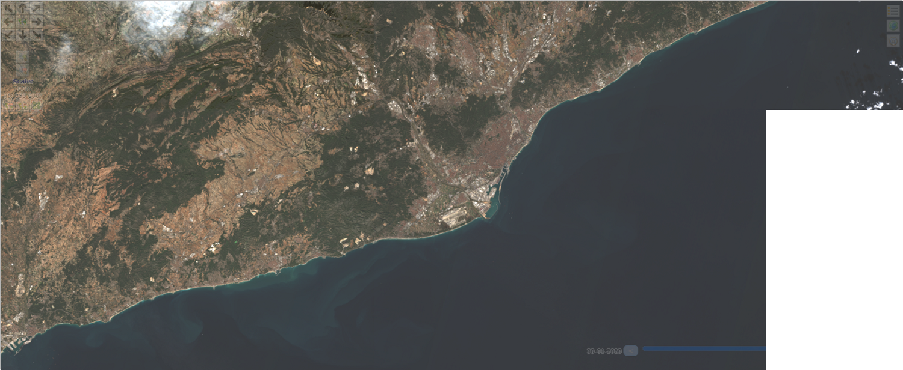

[[rc_core]]
== Requirements Class "Core"

[[maps-core-overview]]
=== Overview

include::requirements/requirements_class_core.adoc[]

The core requirements class specifies a map resource. This is a resource that represents the geospatial data as a rendered map. Requesting a map resource, as defined in the core, results in retrieving a generic map as a graphical representation of the data in the repository being accessed via the API endpoint. When using an implementation of the core requirements class, the representation is not constrained in any way by the client. Therefore, the server is free to return a total or a partial representation of the resource at an arbitrary size. Additional Maps API requirement classes add query parameters to personalize the server behavior to the client needs. These requirement classes define specific parameters that allow the client to control the map size and resolution of the map (width, height, bounding box and CRS) as well as the background of the map. An additional requirement class defines how a map resource can be retrieved as tiles by applying the OGC API - Tiles.

A map resource can be obtained from an arbitrary geospatial resource by adding `/map` to the resource URI. The Maps API Core does not specify to which resources `/map` is applicable. 
However, a list of common paths to resources exposed by the API, where maps can commonly be obtained is presented in the following table. The <<rc_collection-map, Collection Maps>>, <<rc_dataset-map,Dataset maps>> and <<rc_styled-map, Styled Maps>> requirements classes define some of these possibilities.

[#Common-map-resources-in-the-api,reftext='{table-caption} {counter:table-num}']
.Common map resources in a geospatial API
[width = "100%",options="header"]
|===
|Resource	Path |Description
|/map |A map representing dataset behind the API in the default style
|/styles/{styleId}/map |A map representing dataset behind the API in the `styleId` style
|/collections/{collectionId}/map | A map representing `collectionId` in the default style
|/collections/{collectionId}/styles/{styleId}/map | A map representing `collectionId` in the `styleId` style
|===

NOTE: There is no mandatory dependency of the Maps API core on _OGC API - Common_. This allows various Web APIs to implement the core requirements class without the need to comply to the OGC API - Common structure (landing page, conformance, API description). However, many implementations may specify a dependency on _OGC API - Common_ in their conformance page.

=== Map resource

A map distribution of a geospatial resource is a pictorial representation of that resource (map). To create a pictorial representation, a style is added to the data in the geospatial resource by a portrayal engine and following portrayal rules. This style can be internal (default style) or can be governed by the client.

This section defines the core resource of the _OGC API - Maps_ Standard: A map representation for a geospatial resource. To keep the core of _OGC API - Maps_ simple, the core only includes a mechanism to retrieve a map of the size and for the spatiotemporal extent that the server considers optimal.

==== Operation
include::requirements/core/REQ_map-op.adoc[]

==== Response
include::requirements/core/REQ_map-response.adoc[]

Below is an example of the successful HTTP response headers describing a PNG image with 1500 columns and 616 rows in the datum WGS84 and projection UTM zone 31N centered in the Barcelona area.

[%unnumbered%]
[source]
----
HTTP/1.1 200 OK
Content-Type: image/png
Last-Modified: Fri, 21 Jul 2023 14:37:46 GMT
Content-Crs: <https://www.opengis.net/def/crs/EPSG/0/32631>
Content-Bbox: 347736.47,4546722.45,497736.47,4608322.45
Content-Datetime: 2023-01-22T0:00:00Z/2023-01-22T23:59:59Z
Content-Length: 1198247
----

[#img_barcelona,reftext='{figure-caption} {counter:figure-num}']
.Example of a successful HTTP response body containing a PNG image captured by Sentinel 2 image. Date: 2023-01-22

Below is another example of the successful HTTP response headers describing a PNG image in the datum WGS84 and lat/long centered in the Barcelona area.

[%unnumbered%]
[source]
----
HTTP/1.1 200 OK
Content-Type: image/png
Last-Modified: Thu, 27 Jul 2023 14:37:46 GMT
Content-Bbox: 2.1486,41.3674,2.1886,41.4074
----

==== Recommendations

include::recommendations/core/REC_map-op.adoc[]

include::recommendations/core/REC_content-crs.adoc[]

include::recommendations/core/REC_content-attribution.adoc[]

include::recommendations/core/REC_legend-thumbnail-style.adoc[]

include::recommendations/core/REC_multiple-media-types.adoc[]

Retrieving a map without subsetting or tiling has limited use. An implementation should therefore consider allowing retrieving only part of a map by supporting the _map tilesets_ and/or
the _spatial subsetting_ requirements class.

NOTE: The desired encoding is selected using HTTP content negotiation. In addition to the parameters specified by the Maps API core, other parameters should be added.

NOTE: HTTP content negotiation replaces the `FORMAT=` parameter in WMS. However, for convenience, some implementations can implement a `f=` parameter for circumstances where content negotiation is not possible or available (e.g., testing the API in a web browser, or using a URL embedded in an HTML IMG SRC tag).

=== Declaration of conformance classes
To support "generic" clients that want to access implementations of multiple OGC API Standards and extensions - and not "just" a specific API / server, the deployed API must declare the conformance classes it implements and conforms to.

The conformance page mainly consists of a list of links.

include::requirements/core/REQ_conformance-success.adoc[]

If the server declares conformity also to _OGC API - Common - Part 1: Core_ or to _OGC API - Features - Part 1: Core_, then the OGC API requirements for declaring conformance, such as the use of the `/conformance` resource, must be considered. In the JSON format, the conformance resource is an array of links following the link schema defined in _OGC API - Common - Part 1: Core_ or in _OGC API - Features - Part 1: Core_. Below is an example fragment of a conformance information page of an API implementation conformant to _OGC API - Common_ and _OGC API - Maps_.

An example Conformance Information Page fragment is below:

[[ConformancePageMapsCore]]
[%unnumbered%]
[source,JSON]
----
{
  "conformsTo": [
    "https://www.opengis.net/spec/ogcapi-common-1/1.0/conf/core",
    "https://www.opengis.net/spec/ogcapi-common-2/1.0/conf/collections",
    "https://www.opengis.net/spec/ogcapi-maps-1/1.0/conf/core"
  ]
}
----
