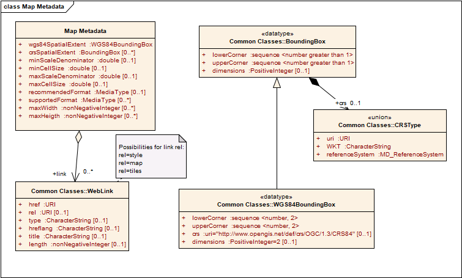

== Requirement Class "Map Core"

=== Overview

[[maps-core-overview]]

include::requirements/requirements_class_core.adoc[]

This core specifies a map resource: a resource that represents the geospatial data as a rendered map. The map resource, as defined in this core retrieves a generic map as a graphical representation of the data in the API. With only the core, the representation is not constrained almost in any way by the client, so the server is free to return a total or a partial representation of the resource of an arbitrary size. Extensions to this core will add query parameters to personalize the server behavior to the client needs. Some of those extension will define specifying parameters that will determine the map resolution (width, height, bounding  box and CRS). In addition, another extension will define how a map endpoint can be retrieved as tiles by applying the OGC API - Tiles.

A map resource can be obtained from a non map resource by adding `/map` the resource. The core does not specify the resources where `/map` can be applied. However, we can list common places in and API where maps can be obtained in following table. Additional conformance classes will better define these possibilities.

[#Common-map-resources-in-the-api,reftext='{table-caption} {counter:table-num}']
.Common map resources in an geospatial API
[width = "100%",options="header"]
|===
|Resource	Path |Description
|/map |A map representing dataset behind the API in the default style
|/styles/{styleId}/map |A map representing dataset behind the API in the `styleId` style.
|/collections/{collectionId}/map | A map representing `collectionId` in the default style
|/collections/{collectionId}/styles/{styleId}/map | A map representing `collectionId` in the `styleId` style
|===

NOTE: There is no mandatory dependency of this core on OGC API - Commons. This allows for non-OGC APIs to implement this core without the need to comply to the OGC API common structure (landing page, conformance, API description). It expected that main implementations will specify a dependency on OGC API - Commons in their conformance page.

=== Declaration of conformance classes
To support "generic" clients that want to access multiple OGC API standards and extensions - and not "just" a specific API / server, the API has to declare the conformance classes it implements and conforms to.

==== Response
The conformance page mainly consists of a list of links.

include::requirements/core/REQ_conformance-success.adoc[]

If the server declares also conformity to OGC API - Common - Part 1: Core or to OGC API - Features - Part 1: Core, then it has to consider the OGC API requirements for declaring conformance, i.e. the use of a the conformance page. In the JSON format the conformance page is an array of links following the link schema defined in the OGC API - Common - Part 1: Core or in OGC API - Features - Part 1: Core. Below is an example fragment of a conformance information page of an API conformant to OGC API - Common and OGC API - Maps.

[[ConformancePageMapsCore]]
.Conformance Information Page fragment
=================
[source,JSON]
{
  "conformsTo": [
    "http://www.opengis.net/spec/ogcapi-common-1/1.0/conf/core",
    "http://www.opengis.net/spec/ogcapi-common-2/1.0/conf/collections",
    "http://www.opengis.net/spec/ogcapi-maps-1/1.0/conf/core"
  ]
}
=================

=== Map resource

A map distribution of a dataset is a pictorial representation of geospatial resources. To create a pictorial representation a style is added to the data in the geospatial resource. This style can be internal (default style) of can be governed by the client.

This section defines the core resource of the OGC API - Maps standard: a map representation for a geospatial resources. To keep the core of the OGC API - Maps standard simple, the core only includes a mechanism to retrieve an map of an arbitrary size and from the extent the server considers optimal.

==== Operation
include::requirements/core/REQ_map-op.adoc[]

include::recommendations/core/PER_map-op.adoc[]

NOTE: The desired encoding is selected using HTTP content negotiation. In addition the parameters specified by the core, other parameters should be added.

==== Parameters transparent and bgcolor
These parameters indicate how the absence of data will be represented in the map and allow for the map to be overlaid with other maps without completely obscuring the lower layers. The parameter `transparent` is maintained for backwards compatibility; the use of the 'alpha channel' in `bgcolor` is recommended instead.

include::requirements/core/REQ_mc-bgcolor-definition.adoc[]

include::requirements/core/REQ_mc-transparent-definition.adoc[]

NOTE: If the client wants to force an opaque color, apart from defining the appropriate background color it should ensure that the parameter `transparent` is set to `false`. For the formats that reserve a color to define transparency, it still makes sense to combine background color and transparent=true with the purpose of helping the server to select a color that does not interfere with the actual values and colors in the map.

NOTE: The `opaque` and `cascaded` parameters present in the WMS have been deprecated and are not provided in this API.

==== Response
The response of a GET request to a map resource will be a map representing the geospatial data in the resource. Without any extra parameters, the server could respond with a maps representing the whole geospatial data resource at maximum resolution that could be too difficult to generate by the server or too big to be efficiently retrieved by the client. It is expected that other query parameters are added by other extensions of this core to personalize the response.

include::requirements/core/REQ_map-response.adoc[]

A successful response to a map GET operation will be consistent with the media type of resource requested. This draft specification does not impose any media type or file format and map responses may be in JPEG, PNG or other appropriate format (including vector based formats such as KML or SVG). It is also possible to respond an HTML page with the image embedded and, eventually, with additional controls.

== Requirement Class "Map Metadata"
=== Overview

[[maps-metadata-overview]]

include::requirements/requirements_class_map-metadata.adoc[]

This extension adds to the core the capability to retrieve a document that contains information (metadata) on the maps that can be useful and necessary to correctly formulate request of other extension such as the subset of a map. The document includes the CRSs and other styles supported and other metadata.

==== Map description document
The core introduces the way data will be combined with styles to create a map. This class defined how to get some metadata about the map that can be used by the client formulate more personalized map requests with the help of query parametres.

==== Map metadata data model
This is the map metadata model to be used by the map metadata respones.

[#img_map-metadata-uml-model,reftext='{figure-caption} {counter:figure-num}']
.Map metadata UML model

[#parts-of-map-metadata-data-structure,reftext='{table-caption} {counter:table-num}']
.Parts of Map Metadata data structure
[width = "100%",options="header"]
|===
| Names | Definition | Data type and values | Multiplicity and use
| wgs84SpatialExtent | Minimum bounding rectangle surrounding the data available a map, in the WGS84 | WGS84BoundingBox data structure, see 2DTMS standard | Zero or one (optional)
| crsSpatialExtent | Minimum bounding rectangle surrounding the data available a map, in the indicated CRS | BoundingBox data structure, see 2DTMS standard | Zero or one (optional)
| minScaleDenominator | Minimum scale denominator (inclusive) for which it is appropriate to generate a map of this resource. Requests outside this interval will return an HTTP 404. | double | Zero or one (optional) If it is not present we will assume there is no scale lower limit
| maxScaleDenominator | Maximum scale denominator (inclusive) for which it is appropriate to generate a map of this resource. Requests outside this interval will return an HTTP 404. | double | Zero or one (optional) If it is not present we will assume there is no scale upper limit
| minCellSize | Maximum cell size (inclusive) for which it is appropriate to generate a map of this resource. Requests outside this interval will return an HTTP 404. | double | Zero or one (optional) If it is not present we will assume there is no cell size lower limit
| maxCellSize | Maximum cell size (inclusive) for which it is appropriate to generate a map of this resource. Requests outside this interval will return an HTTP 404. | double | Zero or one (optional) If it is not present we will assume there is no cell size upper limit
| recommendedFormat | Recommended output formats for a map request^a^ | MediaType | Zero or one (optional) Include when available and useful. It would be one of the supported for the map operation
| supportedFormat | Supported output formats for a map request | MediaType | Zero or more (optional) Include when available and useful
| maxWidth | Maximum width values that a client is permitted to include in a map operation. | nonNegativeInteger  | Zero or one (optional). If absent the server imposes no limit
| maxHeight | Maximum height values that a client is permitted to include in a map operation. | nonNegativeInteger  | Zero or one (optional). If absent the server imposes no limit
| link | Links to related resources | WebLink data structure, see 2DTMS | Zero or more (optional)^b^
4+|^a^    Depending of the nature of the data, a format might be better than another. Categorical data looks better in a PNG but continuous data and pictures are smaller a JPEG. The map operation details all available formats for the OGC API maps. In contrast, this is the better one for this type of information.
^b^    Possible link `rel` values are: `http://www.opengis.net/def/rel/ogc/1.0/style` for a URL pointing to other styles of the resource exposed as maps, 'maps' for a URL template to the map resource. 'alternate' for a URL pointing to another representation of the MapMetadata (e.g a TileJSON file).
|===

NOTE: In WMS this metadata was present in the <layer> section of a GetCapabilities document. Some common metadata such as title, abstract, attribution, etc are not provided by this model. The client is expected to get this information directly from the parent resource that is converted into map (e.g. from the response to \collections\{collectionId}).

NOTE: The supported formats for map resources, or more precisely the media types of the supported encodings, can be also be determined from the API definition. The desired encoding is selected using HTTP content negotiation. In addition the parameters specified by the core, other parameters should be added.

NOTE: The `cascaded` parameter in WMS is removed because no practical use has been seen in past

NOTE: The `opaque` parameter in WMS was rarely useful and has bee removed. It indicated whether the map data represents features that probably do not completely fill space shows the background opaque (true) or transparent(false).

NOTE: The `noSubsets` parameter in WMS has no use. The client will know if the server is no able to generate subsets if there is no subset extension suported in the server.

NOTE: The `fixedWidth` parameter in WMS has no use. The client will know if the server is no able to generate different widths if there is no extension supported in the server describing the use of a width parameter.

NOTE: The `fixedHeight` parameter in WMS has no use. The client will know if the server is no able to generate different widths if there is no extension supported in the server describing the use of a height parameter.

NOTE: `maxWidth` and `maxHeight` are indented to control the work load of the server by providing limitations in size of the outputs of the subset. `width` and `height` parameters are commonly related with the size of the device screen, please consider that new devices are being build with more and more pixels and a reasonable limit in the server size may become too restrictive with the emerging devices.

==== Operation
include::requirements/metadata/REQ_md-op.adoc[]

NOTE: The desired encoding is selected using HTTP content negotiation. In addition the parameters specified by the core, other parameters should be added.

==== Response
The response of a GET request to a map metadata resource will be a text document describing the map resource.

include::requirements/metadata/REQ_md-response.adoc[]

If the API has a OpenAPI document describing the schema for the response, the following JSON Schema can be used to defined the response.

[[MapMetadataJSONSchema]]
.Map metadata JSON Schema
=================
[source,JSON]
----
{
	"$schema": "http://json-schema.org/draft-07/schema#",
	"type": "object",
	"properties":
	{
		"wgs84SpatialExtent":
		{
			"$ref": "#/definitions/bbox"
		},
		"crsSpatialExtents":
		{
			"type": "array",
			"items": {
				"$ref": "#/definitions/crsSpatialExtent"
			}
		},
    "supportedCRSs":
		{
      "type": "array",
			"items": {
			     "$ref": "crs.json"
      }
		},
		"minScaleDenominador":
		{
			"type": "number",
			"description": "Minimum scale denominator (inclusive) for which it is appropriate to generate a map of this collection. Requests outside this interval will return an HTTP 404. If it is not present we will assume there is no limit"
		},
		"minCellSize":
		{
			"type": "number",
			"description": "Minimum cell size (inclusive) for which it is appropriate to generate a map of this collection. Requests outside this interval will return an HTTP 404. If it is not present we will assume there is no limit"
		},
		"maxScaleDenominador":
		{
			"type": "number",
			"description": "Maximum scale denominator (inclusive) for which it is appropriate to generate a map of this collection. Requests outside this interval will return an HTTP 404 If it is not present we will assume there is no limit"
		},
		"maxCellSize":
		{
			"type": "number",
			"description": "Maximum cell size (inclusive) for which it is appropriate to generate a map of this collection. Requests outside this interval will return an HTTP 404. If it is not present we will assume there is no limit"
		},
		"recomendedFormat":
		{
			"type": "string",
			"description": "Recommended output formats for a map request. Depending of the nature of the data, a format might be better than another. Categorical data looks better in a PNG but continuous data and pictures are smaller a JPEG. The map operation details all available formats for the OGC API maps. In contrast, this is the better one for this type of information. It would be one of the supported for the map operation"
		},
    "supportedFormats":
		{
      "type": "array",
      "description": "Supported output formats for a map request",
      "items": {
			     "type": "string"
			}
		},
		"maxWidth":
		{
			"type": "number",
			"description": "Maximum width and height values that a client is permitted to include in bbox subset operation.  If absent the server imposes no limit"
		},
		"maxHeight":
		{
			"type": "number",
			"description": "Maximum width and height values that a client is permitted to include in bbox subset operation.  If absent the server imposes no limit."
		}
	},
	"definitions":
	{
		"bbox":
		{
			"description": "West, south, east, north edges of the bounding box. The coordinates are in the coordinate reference system specified in `crs`. By default this is WGS 84 longitude/latitude (CRS84).",
			"type": "array",
			"minItems": 4,
			"maxItems": 6,
			"items":
			{
				"type": "number"
			}
		},
		"crsSpatialExtent":
		{
			"description": "The spatial extent of the resource",
			"type": "object",
			"properties":
			 {
				"crs":
				{
					"type": "string"
				},
				"bbox":
				{
					"$ref": "#/definitions/bbox"
				}
			}
		}
	}
}
----
=================
